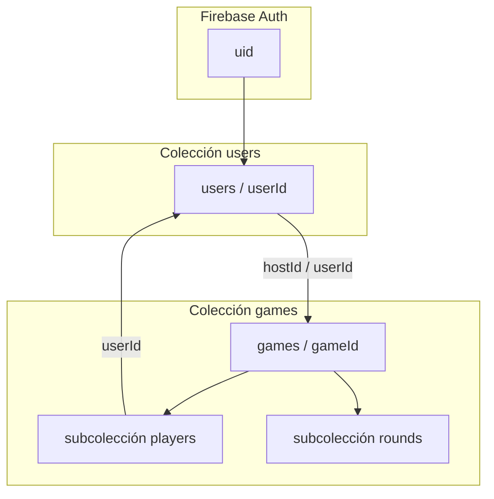
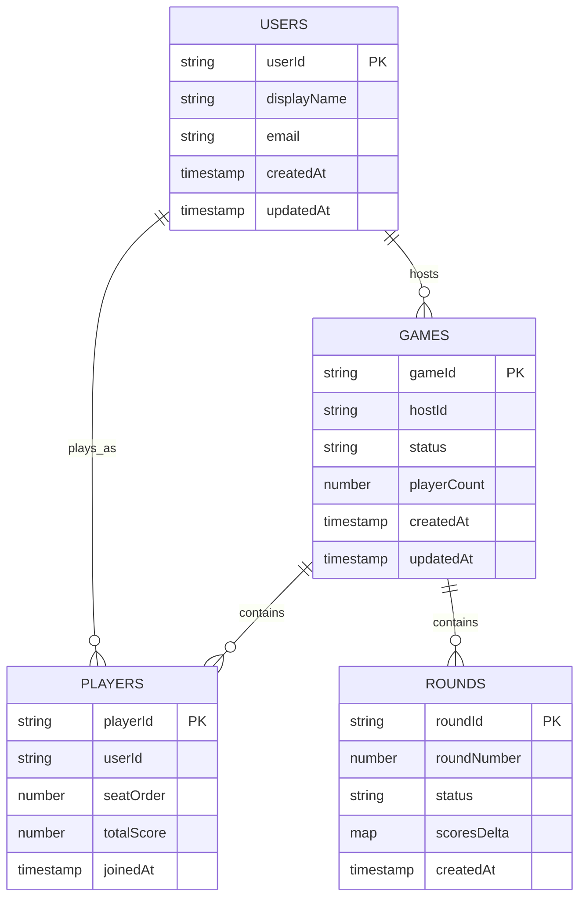

# Modelo de datos — La Pocha (Firestore)

> **Estado:** borrador orientativo. Los campos marcados como *(TBD)* se definirán cuando el modelo de negocio esté cerrado.  
> **Acceso:** app Flutter vía Firebase SDK (Auth + Firestore). Ver [`firebase-data-access.yml`](./firebase-data-access.yml).  
> **Obsoleto:** `api-spec.yml` (REST). Identificadores de colecciones y campos en **inglés** en código y Firestore.

## 1. Convenciones Firestore

| Concepto SQL/Prisma | Equivalente Firestore |
|---------------------|------------------------|
| Tabla | **Colección** de primer nivel (`games`, `users`) |
| Fila | **Documento** (`games/{gameId}`) |
| Clave primaria autoincremental | **ID de documento** (auto-generado o igual al `uid` de Auth en perfiles) |
| Clave foránea | **Referencia** (`DocumentReference`) o **ID denormalizado** (`string userId`) |
| Tabla hija 1:N | **Subcolección** (`games/{gameId}/players/{playerId}`) |
| JOIN | Lecturas múltiples, referencias o **datos denormalizados** para lecturas frecuentes |
| `created_at` / `updated_at` | `Timestamp` (`createdAt`, `updatedAt`; usar `FieldValue.serverTimestamp()` en escrituras) |
| Transacción SQL | **`runTransaction`** o **`WriteBatch`** de Firestore |
| Unicidad global (p. ej. email) | Validación en **reglas de seguridad** + comprobación en use case; no hay `UNIQUE` nativo |

### Rutas de colección (resumen)

```text
users/{userId}
games/{gameId}
games/{gameId}/players/{playerId}
games/{gameId}/rounds/{roundId}
```

### Tipos habituales en documentos

- `string`, `number`, `boolean`, `timestamp`, `array`, `map`
- `DocumentReference` cuando se necesite navegación tipada (p. ej. `hostRef` → `users/{uid}`)
- Enums de dominio como `string` con valores acordados (`status: "lobby" | "in_progress" | "finished"`)

---

## 2. Visión del dominio

**La Pocha** es una app para gestionar partidas del juego de cartas: usuarios autenticados crean o se unen a **partidas** (`games`), participan como **jugadores** (`players`) y registran el progreso por **rondas** (`rounds`).



---

## 3. Colección `users`

Perfil de aplicación vinculado a **Firebase Authentication**. Se recomienda `userId == Auth.uid`.

**Ruta:** `users/{userId}`

| Campo | Tipo | Obligatorio | Descripción |
|-------|------|-------------|-------------|
| `displayName` | string | sí *(TBD longitud)* | Nombre visible en partidas |
| `email` | string | sí | Copia o reflejo del email de Auth *(solo lectura desde Auth si se prefiere)* |
| `photoUrl` | string | no | URL de avatar |
| `createdAt` | timestamp | sí | Alta del perfil |
| `updatedAt` | timestamp | sí | Última modificación |
| `lastSeenAt` | timestamp | no | Presencia / actividad *(TBD)* |

**Relaciones:**

- Un documento por usuario autenticado.
- Referenciado desde `games.hostId`, `games/{gameId}/players.userId` (ID o `DocumentReference` a `users/{userId}`).

**Reglas de negocio *(borrador)*:**

- Solo el propio `userId` puede crear/actualizar su perfil (salvo admin *(TBD)*).
- `displayName` no vacío.

---

## 4. Colección `games`

Representa una **partida** (sesión de juego): lobby, en curso o finalizada.

**Ruta:** `games/{gameId}`

| Campo | Tipo | Obligatorio | Descripción |
|-------|------|-------------|-------------|
| `title` | string | no | Nombre opcional de la partida *(TBD)* |
| `hostId` | string | sí | `userId` del creador / anfitrión |
| `participantIds` | array\<string\> | sí (nube) | IDs de usuarios registrados en `players[]`; para consultas `array-contains` |
| `status` | string | sí | `setup`, `in_progress`, `finished` |
| `playerCount` | number | sí | Número de jugadores (3–8) |
| `deckSize` | number | sí | Tamaño del mazo |
| `maxCardsPerRound` | number | sí | Máximo de cartas por ronda |
| `totalRounds` | number | sí | Longitud de `roundSequence` |
| `roundSequence` | array\<number\> | sí | Cartas por ronda (secuencia precalculada) |
| `players` | array\<map\> | sí | Roster embebido; ver §5 |
| `firstDealerPlayerId` | string | sí | `playerId` del primer repartidor |
| `currentRoundNumber` | number | no | Última ronda jugada |
| `createdAt` | timestamp | sí | Creación |
| `updatedAt` | timestamp | sí | Último cambio |
| `startedAt` | timestamp | no | Inicio de partida |
| `finishedAt` | timestamp | no | Cierre |

**Relaciones:**

- **1:N** → subcolección `rounds` (detalle ronda a ronda).
- **N:1** → `users` vía `hostId` y `participantIds`.
- Roster en `players[]` embebido (no subcolección en Firestore).

**Reglas de negocio *(borrador)*:**

- Tras la última ronda cerrada, `FinishGameUseCase` pasa `status` de `in_progress` a `finished` y establece `finishedAt`.
- Al subir a Firestore (`syncFinishedGame`, LPT-20): `hostId == Auth.uid`, `participantIds` desde `players[].userId` no nulos, escritura atómica con `WriteBatch`.
- Borrado: preferir **soft delete** con `status: "cancelled"` *(TBD)* en lugar de borrar documentos con historial.

**Persistencia local (Drift):** la tabla `games` incluye `finishedAt` (schema v4), `cloudGameId` y `syncStatus` (schema v5). Campos de sync solo existen en local:

| Campo local | Tipo | Valores |
|-------------|------|---------|
| `cloudGameId` | string? | ID del documento Firestore tras subida (`== gameId`) |
| `syncStatus` | string? | `local`, `pending`, `synced`, `failed` |

---

## 5. Roster embebido `players[]` en `games`

Jugadores **dentro de una partida concreta**, modelados como array embebido en `games/{gameId}` (Firestore y local Drift).

**No usar subcolección** `games/{gameId}/players/` en implementaciones MVP (ver readme.md §3).

| Campo | Tipo | Obligatorio | Descripción |
|-------|------|-------------|-------------|
| `id` | string | sí | Identificador del jugador en la partida |
| `displayName` | string | sí | Nombre visible en mesa |
| `userId` | string | no | `users/{uid}` si registrado; null si invitado |
| `isGuest` | boolean | sí | true si se añadió por nombre libre |
| `seatOrder` | number | sí | Orden en mesa (0…n−1) |
| `totalScore` | number | sí | Puntuación acumulada al cierre |
| `joinedAt` | timestamp | sí | Alta en el roster |

**Reglas de negocio *(borrador)*:**

- Un mismo `userId` no debería aparecer dos veces en la misma partida (validar en use case + reglas).
- `players.length` debe coincidir con `playerCount` antes de iniciar.

**Clonación desde historial (LPT-8):** `RepeatGameUseCase` crea un nuevo borrador local (`status: setup`, nuevo `gameId`) copiando `playerCount`, `totalCards`, `maxCardsPerRound`, `roundSequence` y el roster embebido (`displayName`, `userId`, `isGuest`, `seatOrder`) con `totalScore` en 0. No copia rondas `closed`, `firstDealerPlayerId`, fechas de partida ni metadatos de sync. Para partidas en nube, lee `players[]` del documento `games/{gameId}` (no subcolección).

---

## 6. Subcolección `rounds`

Una **ronda** (mano) dentro de la partida: apuestas, bazas, puntuación parcial, etc. Detalle de reglas del juego *(TBD)*.

**Ruta:** `games/{gameId}/rounds/{roundId}`

| Campo | Tipo | Obligatorio | Descripción |
|-------|------|-------------|-------------|
| `roundNumber` | number | sí | Orden secuencial (1, 2, 3…) |
| `cardsInRound` | number | sí | Cartas repartidas a cada jugador en esta ronda |
| `dealerPlayerId` | string | sí | `playerId` del repartidor de la ronda |
| `status` | string | sí | `bidding`, `playing`, `closed` (MVP local) |
| `bids` | map\<string, number\> | no | Apuestas por `playerId` (`playerId` → entero 0…`cardsInRound`) |
| `tricks` | map\<string, number\> | no | Bazas reales por `playerId` |
| `scoresDelta` | map\<string, number\> | no | Puntos de la ronda por `playerId` |
| `createdAt` | timestamp | sí | Apertura de ronda |
| `closedAt` | timestamp | no | Cierre y reparto de puntos |

**Ejemplo de `bids` (map):**

```json
{
  "playerId_abc": 3,
  "playerId_def": 2,
  "playerId_ghi": 1,
  "playerId_jkl": 0
}
```

**Persistencia local (Drift):** columna `bids` como `TEXT` serializado con `MapStringIntConverter` (`Map<String, int>`).

**Alineación Firestore:** el campo se documenta como `bids` (map); en borradores anteriores aparecía como `bid` singular — usar `bids` en implementaciones nuevas.

**Ejemplo de `scoresDelta` (map):**

```json
{
  "playerId_abc": 2,
  "playerId_def": -1
}
```

**Relaciones:**

- **N:1** → `games/{gameId}`.
- Referencias opcionales a documentos en `players` mediante `playerId` en mapas (no FK automática).

**Reglas de negocio *(borrador)*:**

- `roundNumber` único por partida (transacción al crear la siguiente ronda).
- No modificar rondas `closed` salvo corrección admin *(TBD)*.
- **Solo la ronda actual es editable (LPT-12):** las correcciones de datos (apuestas y bazas) solo se permiten mientras la ronda no está `closed`. Las rondas `closed` no son editables desde la UI.
- **Corrección de apuestas en fase `playing` (LPT-12):** el organizador puede reeditar cualquier apuesta tras cerrar apuestas (`CorrectBidsUseCase`). Se re-valida la restricción del repartidor: si tras la corrección `sum(bids) == cardsInRound`, la corrección se persiste pero **se bloquea el avance** a la introducción de bazas hasta que el repartidor ajuste su apuesta.
- **Corrección de bazas antes de cerrar (LPT-12):** durante la fase `playing`, las bazas se editan libremente como borrador en la pantalla de bazas y solo se persisten (`tricks`, `scoresDelta`, `totalScore`) al confirmar el cierre; recalcular la suma y los puntos ocurre en ese momento.
- **Restricción del repartidor (apuestas):** la suma total de `bids` **no puede igualar** `cardsInRound`. El repartidor apuesta siempre el último; al llegar su turno, el **número prohibido** es `cardsInRound - sum(bids de los demás)`. Si intenta apostar ese valor, se bloquea la confirmación.
- Orden de apuestas: jugador siguiente al repartidor en `seatOrder` primero; repartidor último.
- Transición de estado al cerrar apuestas: `bidding` → `playing`.
- Transición al cerrar bazas: `playing` → `closed`; se persisten `tricks`, `scoresDelta` y `closedAt`.
- **Repetir ronda actual (LPT-13):** acción de recuperación solo sobre la ronda en curso (`status` `bidding` o `playing`). Operación atómica local (`RepeatRoundUseCase`): limpia `bids`, `tricks` y `scoresDelta` de la ronda actual, revierte en `players.totalScore` el `scoresDelta` si existía, restablece `status` a `bidding` manteniendo `dealerPlayerId` y `cardsInRound`. Las rondas `closed` permanecen inmutables.
- **Reglas de puntuación por ronda** (calculadas al cerrar, ver LPT-11):
  - Si `tricks[playerId] == bids[playerId]`: `scoresDelta = 10 + (5 × tricks)`.
  - Si difieren: `scoresDelta = -5 × |bids[playerId] - tricks[playerId]|`.
  - `players.totalScore` se incrementa con `scoresDelta` de la ronda (persistencia local Drift; Firestore en sync futuro).

---

## 7. Diagrama de colecciones (Firestore)



> En Firestore, `PK` = ID del documento. Las líneas indican relación lógica, no integridad referencial automática.

---

## 8. Índices compuestos *(borrador)*

Definir en `firestore.indexes.json` según consultas reales. Candidatos:

| Colección | Campos | Uso |
|-----------|--------|-----|
| `games` | `hostId` + `createdAt` desc | Partidas creadas por un usuario |
| `games` | `status` + `updatedAt` desc | Listar partidas activas |
| `games/{gameId}/rounds` | `roundNumber` asc | Ordenar rondas |
| `games/{gameId}/players` | `userId` | Buscar si un usuario ya está en la partida |

---

## 9. Seguridad *(borrador)*

Alinear `firestore.rules` con:

- `users/{userId}`: lectura autenticada; escritura solo si `request.auth.uid == userId`.
- `games/{gameId}`: lectura para participantes *(TBD: claim o membership en `players`)*; escritura según `hostId` y `status`.
- `players`, `rounds`: acceso limitado a miembros de la misma `gameId`.

Detalle de reglas en implementación; este documento solo fija intención.

---

## 10. Principios de diseño

1. **IDs estables:** Auth `uid` para perfiles; IDs auto-generados para `gameId`, `playerId`, `roundId` salvo decisión contraria.
2. **Subcolecciones para datos acotados a una partida** (`players`, `rounds`) y reglas por ruta.
3. **Denormalización controlada:** `displayName` en `players`, `playerCount` en `games` para listados; actualizar en transacción cuando cambie el origen.
4. **Tiempo real:** `snapshots()` en partida activa para lobby y ronda en curso.
5. **Evolución:** nuevos campos con valores por defecto; evitar renombrar colecciones en producción sin migración.

---

## 11. Checklist al cerrar el modelo definitivo

- [ ] Confirmar valores de `status` en `games`, `players`, `rounds`
- [ ] Definir estructura de `settings`
- [x] Definir estructura de `tricks` y `scoresDelta` (map `playerId` → entero; ver §6 y reglas LPT-11)
- [x] Definir estructura de `bids` (map `playerId` → entero; ver §6)
- [ ] Decidir `DocumentReference` vs `string` para enlaces a `users`
- [ ] Actualizar `firebase-data-access.yml` y `firestore.rules`
- [ ] Añadir índices medidos en consola Firebase
- [ ] Reflejar entidades en capa `domain/` de la app (`User`, `Game`, `Player`, `Round`)

---

## 12. Historial

### 12.1 Ocultado de historial (LPT-17)

El historial combina partidas **locales** (Drift) y **en nube** (Firestore). La eliminación desde la app del usuario sigue dos caminos:

| Origen | Acción en dispositivo | Efecto remoto |
|--------|----------------------|---------------|
| `GameHistorySource.local` | Borrado físico en Drift (`games` + `rounds` en cascada) | Ninguno, salvo que la partida tuviera `cloudGameId` sincronizado |
| `GameHistorySource.cloud` | Solo ocultación local | **Nunca** se borra `games/{gameId}` en Firestore |

**Partidas locales sincronizadas** (`cloudGameId != null`): se borra la fila local y se registra el `cloudGameId` como oculto para que no reaparezca al sincronizar.

**Implementación MVP de `hiddenGameIds`:** tabla Drift local `hidden_games` (`gameId TEXT PRIMARY KEY`, schema v6). No se persiste en `users/{uid}` en Firestore en esta fase.

### 12.2 Favoritos locales (LPT-18)

Los jugadores favoritos se guardan **solo en el dispositivo** (Drift). No hay colección Firestore en el MVP.

**Tabla Drift `favorites`** (schema v7, una fila por favorito):

| Campo | Tipo | Obligatorio | Descripción |
|-------|------|-------------|-------------|
| `id` | TEXT | sí | Clave primaria (UUID) |
| `displayName` | TEXT | sí | Nombre mostrado en listas y al añadir a partida |
| `userId` | TEXT | no | `null` = invitado; valor = usuario registrado vinculado |
| `createdAt` | DATETIME | sí | Fecha de alta del favorito |

**Deduplicación en dominio:** no permitir dos favoritos con el mismo `userId` ni con el mismo `displayName` (comparación case-insensitive).

| Fecha | Cambio |
|-------|--------|
| 2026-07-13 | LPT-18: favoritos locales en Drift (`favorites`, schema v7); sin Firestore en MVP |
| 2026-07-13 | LPT-17: borrado local vs ocultación de partidas en nube; tabla `hidden_games` |
| 2026-06-03 | Reescritura: dominio La Pocha (users, games, players, rounds) en terminología Firestore; eliminado modelo LTI/relacional |
