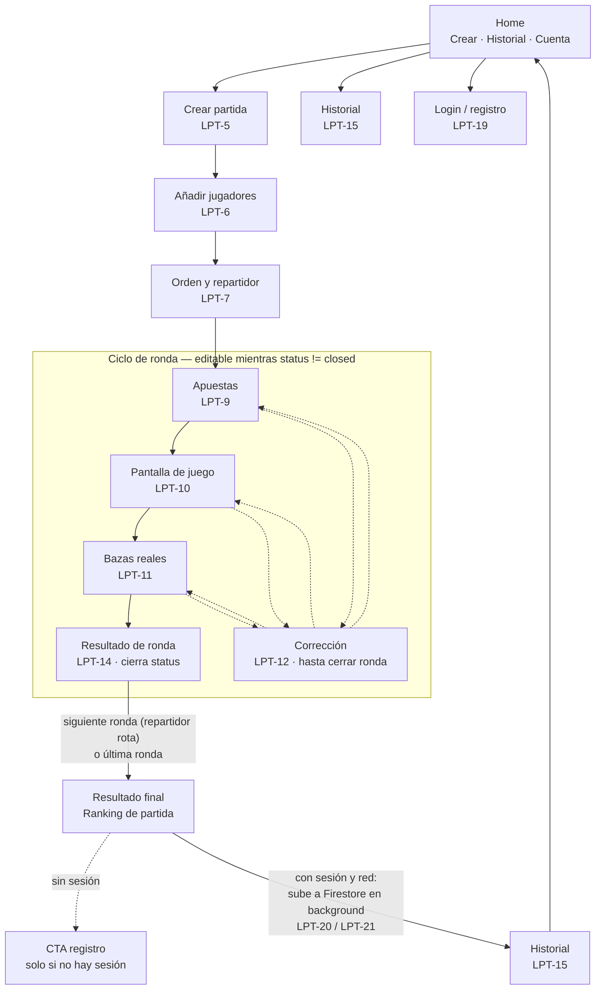

This file contains base rules for an AI agent. I need you to rewrite it for 
a different stack, keeping the exact same structure and purpose.

New stack:
- Mobile app: Flutter (Dart)
- Backend/Database: Firebase (Firestore + Authentication)
- State management: BLoC pattern (flutter_bloc package)
- Architecture: Clean Architecture — presentation (BLoC + widgets), 
  domain (use cases + entities), data (repositories + Firebase datasources)
- Platform: Android / iOS
- Code and comments: English
- Documentation, commits and PR descriptions: Spanish
- No REST API; all data access through Firebase SDK

Replace all React, Node, TypeScript and frontend/backend web references 
with their Flutter/Firebase/BLoC equivalents. Make the result implementation-ready 
for AI agents working in Cursor on this project.

--------------------------

- Deprecate or remove backend-standards.mdc and frontend-standards.mdc 
  since they describe Node/React which is not our stack.
- Update AGENTS.md to reference only the new Flutter/Firebase standards.
- Update any commands in ai-specs/.commands/ that still reference 
  the old backend/frontend standards.

----------------------

Adapt or mark as obsolete ai-specs/specs/development_guide.md and api-spec.yml 
since they describe a web stack. Replace any REST/API references with 
Firebase SDK equivalents, or add a deprecation notice if they are not relevant 
for a Flutter/Firebase project.

---------------------

Update mobile-standards.mdc and AGENTS.md to reference the installed 
skills in .agents/skills/. Specifically ensure agents use:
- flutter-apply-architecture-best-practices
- dart-add-unit-test
- flutter-add-integration-test  
- dart-generate-test-mocks
- flutter-implement-json-serialization
- flutter-setup-declarative-routing
when performing related tasks.

------------------------

Actúa como un Product Owner senior con experiencia en apps móviles.
Genera un PRD (Product Requirements Document) completo en español para
la siguiente app móvil:

## Contexto

App móvil Flutter llamada "La Pocha" — marcador digital para el juego
de cartas español homónimo. El objetivo es sustituir el papel y lápiz
con una experiencia ágil y sencilla.

## Decisiones ya tomadas

### Jugadores y cartas

- Mínimo 3, máximo 8 jugadores
- El número de cartas se determina automáticamente por el número de jugadores:
  - 3 jugadores: 30 cartas, máximo 10 por ronda
  - 4 jugadores: 40 cartas, máximo 10 por ronda
  - 5 jugadores: 40 cartas, máximo 8 por ronda
  - 6 jugadores: 48 cartas, máximo 8 por ronda
  - 7 jugadores: 49 cartas (+ comodín), máximo 7 por ronda
  - 8 jugadores: 48 cartas, máximo 6 por ronda

### Puntuación

- Acierto: 10 + (5 × bazas conseguidas)
- Fallo: -5 × diferencia entre bazas apostadas y conseguidas
- Restricción del repartidor: obligatoria. La suma de apuestas no puede
  igualar el número de bazas disponibles. No se puede cerrar la fase de
  apuestas si se incumple.

### Flujo de una ronda

1. Introducir apuestas en orden; el repartidor apuesta el último
2. Pantalla de juego: muestra apuestas de cada jugador, puntuación
   acumulada y balance de bazas pedidas vs disponibles en tiempo real
3. Introducir bazas reales obtenidas
4. Pantalla de resultado de ronda: ranking, puntuación total, delta
   respecto a ronda anterior

- Corrección permitida solo en ronda actual
- Si una corrección viola la restricción del repartidor, se bloquea
  hasta que el repartidor corrija sus bazas
- Posibilidad de repetir una ronda completa

### Configuración de partida

- El usuario elige número de jugadores (3-8); el resto se calcula solo
- Primer repartidor: por defecto el primero de la lista, con botón
  "🎲 Repartidor aleatorio"
- El orden de jugadores es editable antes de empezar y determina la
  rotación del reparto

### Jugadores

- Tres formas de añadir un jugador: nombre libre, buscar usuario
  registrado por nombre de usuario, o seleccionar de lista de favoritos
- Favoritos: lista local de jugadores frecuentes, pueden ser
  registrados o no
- El orden de jugadores puede modificarse antes de empezar la partida

### Cuenta y sincronización en la nube

- Registro completamente opcional
- Sin cuenta: todo funciona en local, sin conexión
- Con cuenta: las partidas se suben automáticamente a la nube al
  finalizar
- Los jugadores de la partida que tengan cuenta registrada reciben
  la partida automáticamente en su historial
- Partidas locales previas al registro: se quedan en local
- Historial único con icono diferenciador local/nube

### Historial

- Listado de todas las partidas (locales y en nube mezcladas)
- Detalle de una partida: resultado ronda a ronda
- Repetir partida: crea nueva partida con misma configuración y
  jugadores, editable antes de empezar

## Alcance del MVP

Incluye todo lo descrito arriba.

## Post-MVP explícito (NO incluir en MVP)

- Subida manual de partidas locales antiguas tras registrarse
- Campeonatos y ligas entre amigos
- Estadísticas sociales y gamificación
- Variantes random durante la partida
- Soporte para 2 jugadores

## Estructura del PRD

El documento debe incluir:

1. Visión del producto y problema que resuelve
2. Usuarios objetivo (2-3 personas)
3. Propuesta de valor
4. Alcance del MVP (qué sí, qué no)
5. Flujo E2E prioritario descrito en prosa
6. Funcionalidades principales
7. Restricciones técnicas
8. Métricas de éxito para el MVP

Sé específico y evita generalidades. El documento debe ser suficientemente
claro para que cualquier desarrollador pueda entender el producto sin
explicación adicional.

---------------------------

Dado este PRD: @docs/PRD.com

Genera la sección "Descripción general del producto" para el @readme.md
del proyecto. Debe incluir:

- Qué es el producto y qué problema resuelve (3-4 líneas)
- Propuesta de valor principal (bullet points)
- Funcionalidades principales del MVP (bullet points)
- Flujo E2E prioritario resumido (3-4 líneas)

Formato markdown. Tono técnico pero accesible. Máximo una página.

-----------

### Historias de usuario — Generación inicial
**Herramienta:** Claude (chat conversacional)
**Proceso:** Sesión de metaprompting para afinar el producto antes de 
generar las historias. Se definieron reglas del juego, flujos de UX, 
modelo de sincronización local/nube y casos edge antes de producir 
las historias.
**Resultado:** 15 historias organizadas en 4 épicas (Gestión de partida, 
Flujo de ronda, Historial, Cuenta y sincronización)
**Ajuste humano:** 
  ***Decisión:*** Se detectó la ausencia de funcionalidad de borrado de 
partidas y gestión de favoritos. Se añadieron dos historias Must-Have 
y se actualizó el PRD.
  ***Motivo:*** La IA no contempló la gestión del ciclo de vida de los datos. 
Revisión humana necesaria.
**Conversación completa:** [enlace a esta conversación si la exportas]


--------------


Create the following user stories as Jira tickets in project LA-POCHA. 
For each ticket set status "To refine", add the corresponding epic, 
priority (High for Must-Have, Medium for Should-Have), and estimate (S/M/L).

EPIC: Gestión de partida
1. Como organizador, quiero crear una nueva partida seleccionando el número 
   de jugadores, para que la app genere automáticamente la secuencia de 
   rondas y el número de cartas. Priority: High. Size: M.
2. Como organizador, quiero añadir jugadores por nombre libre, buscando 
   usuarios registrados o seleccionando de mis favoritos, para configurar 
   la partida rápidamente. Priority: High. Size: M.
3. Como organizador, quiero reordenar los jugadores y elegir el primer 
   repartidor (o asignarlo aleatoriamente), para respetar el orden físico 
   de la mesa. Priority: High. Size: S.
4. Como organizador, quiero repetir una partida desde el historial, para 
   recrear la misma configuración sin introducir los datos de nuevo. 
   Priority: High. Size: S.

EPIC: Flujo de ronda
5. Como organizador, quiero introducir las apuestas de cada jugador en 
   orden (repartidor al final) con validación de la restricción en tiempo 
   real, para cerrar la fase de apuestas sin errores. Priority: High. Size: L.
6. Como organizador, quiero ver durante el juego las apuestas, puntuación 
   acumulada y balance de bazas de cada jugador, para que todos puedan 
   seguir el estado de la partida. Priority: High. Size: M.
7. Como organizador, quiero introducir las bazas reales obtenidas y que 
   la app calcule los puntos automáticamente, para eliminar errores de 
   cálculo. Priority: High. Size: M.
8. Como organizador, quiero poder corregir apuestas o bazas en la ronda 
   actual, para subsanar errores de introducción. Priority: High. Size: M.
9. Como organizador, quiero poder repetir una ronda completa, para 
   gestionar situaciones excepcionales durante el juego. 
   Priority: High. Size: S.
10. Como organizador, quiero ver el resultado de cada ronda con ranking 
    y puntuación acumulada, para que todos los jugadores conozcan su 
    posición. Priority: High. Size: S.

EPIC: Historial
11. Como jugador, quiero ver un listado de todas mis partidas jugadas 
    (locales y en nube), para consultar mi historial de juego. 
    Priority: High. Size: M.
12. Como jugador, quiero ver el detalle de una partida pasada ronda a 
    ronda, para recordar cómo se desarrolló. Priority: High. Size: M.
13. Como jugador, quiero eliminar partidas de mi historial, para mantener 
    solo las que me interesa conservar. Priority: High. Size: S.
14. Como jugador, quiero gestionar mi lista de favoritos (añadir y 
    eliminar), para mantenerla actualizada. Priority: High. Size: S.

EPIC: Cuenta y sincronización
15. Como jugador, quiero registrarme y hacer login con email y contraseña, 
    para poder sincronizar mis partidas en la nube. 
    Priority: Medium. Size: M.
16. Como jugador registrado, quiero que mis partidas se suban 
    automáticamente al finalizarlas, para tener mi historial disponible 
    en la nube sin ninguna acción adicional. Priority: Medium. Size: M.
17. Como jugador registrado, quiero recibir automáticamente en mi historial 
    las partidas en las que participé aunque no fuera yo quien llevara el 
    marcador, para ver todas mis partidas desde mi cuenta. 
    Priority: Medium. Size: M.


-----------------

Use /multitask to process the following Jira tickets in parallel.
Use Atlassian  CLI (acli) to read and update Jira tickets.

For each ticket:

1. Read the current ticket description using acli
2. Run /enrich-us with the ticket content and the PRD at docs/PRD.md
   as context
3. Update the ticket in Jira with the enhanced content using acli,
   keeping the [original] section and adding the [enhanced] section

Tickets to process in parallel:
LPT-6, LPT-7, LPT-8, LPT-9, LPT-10, LPT-11, LPT-12, LPT-13,
LPT-14, LPT-15, LPT-16, LPT-17, LPT-18

---------------
Use /multitask to process the following Jira tickets in parallel.
The Atlassian MCP is not available, use acli (C:\Users\juanm\acli.exe)
to read and update Jira tickets instead.

For each ticket:

1. Read the current ticket description using acli
2. Run /enrich-us with the ticket content and the PRD at docs/PRD.md
   as context
3. Update the ticket in Jira with the enhanced content using acli,
   keeping the [original] section and adding the [enhanced] section

Tickets to process in parallel:
LPT-19, LPT-20, LPT-21

-------------------

Using acli (C:\Users\juanm\acli.exe), update the Jira ticket LPT-5.

Read the current description of LPT-5 and apply ONLY these two changes:

1. In the acceptance criteria, replace criterion 3 with:
"La secuencia de rondas sigue el patrón ascendente-plateau-descendente:
1, 2, …, M (repetido N veces, siendo N el número de jugadores), M-1, …, 2, 1.
Ejemplo con 4 jugadores (M=10): 1,2,3,4,5,6,7,8,9,10,10,10,10,9,8,7,6,5,4,3,2,1 = 22 rondas."

2. In the configuration table, replace the "Rondas (2M−1)" column
with "Rondas (2M−1+N)" and update values:
| Jugadores | Cartas totales | Máx. por ronda (M) | Rondas |
|-----------|----------------|--------------------|--------|
| 3         | 30             | 10                 | 21     |
| 4         | 40             | 10                 | 22     |
| 5         | 40             | 8                  | 19     |
| 6         | 48             | 8                  | 21     |
| 7         | 49 (+ comodín) | 7                  | 19     |
| 8         | 48             | 6                  | 18     |

Do not modify any other content. Preserve all existing formatting.

------------

Read the PRD at docs/PRD.md and update the readme.md in the repository
root with the following two sections:

## Ficha del proyecto

Generate a project card with these fields:

- Nombre: La Pocha
- Descripción corta: one sentence
- Stack: Flutter + Firebase (Firestore + Authentication)
- State management: BLoC
- Plataforma: Android / iOS
- Autor: [leave blank for the user to fill]
- Repositorio: [leave blank for the user to fill]

## Descripción general del producto

Based on PRD sections 1, 2, 3 and 5, write a concise product description
in Spanish including:

- What it is and what problem it solves (3-4 lines)
- Target users (the 3 personas from the PRD, summarized)
- Main value proposition (bullet points)
- MVP E2E flow summarized (3-4 lines)

Keep markdown formatting clean. Write in Spanish.
Do not modify any other existing content in readme.md.

----------------

### Seguridad — Eliminación de secretos expuestos
**Tipo:** Corrección humana
**Problema:** firebase_options.dart subido accidentalmente al repo público
**Solución:** git rm --cached, rotación de API key en Firebase, 
GitHub Secret configurado
**Lección:** Configurar .gitignore antes del primer commit, 
no después

-------

Read the PRD at docs/PRD.md and the standards at .cursor/rules/.
Generate the architecture section for readme.md in Spanish, filling 
these subsections:

## 2.1 Diagrama de arquitectura
Generate a Mermaid diagram showing the main components:
- Flutter app (presentation/domain/data layers)
- Local storage (device)
- Firebase Authentication
- Firebase Firestore
Show the data flow for both offline and online scenarios.
Justify the Clean Architecture choice and BLoC pattern.

## 2.2 Descripción de componentes principales
Describe each component with the technology used.

## 2.3 Estructura de ficheros
Show the folder structure under lib/ following Clean Architecture 
with BLoC. Include a brief description of each main folder.

## 2.4 Infraestructura y despliegue
Describe Firebase infrastructure and the deployment process 
for the Flutter app (APK/TestFlight).

## 2.5 Seguridad
Describe security practices: Firebase Auth, Firestore Security Rules, 
local data, secrets management.

## 2.6 Tests
Describe the testing strategy: unit tests (domain logic), 
integration tests (BLoC + repository), E2E test (main flow).

Do not modify any other section of readme.md.
Write in Spanish. Use Mermaid for diagrams.

------------

In readme.md, apply these two corrections to section 2:

1. Section 2.3: Replace any reference to SQLite or drift with
"local storage (technology to be confirmed in Entrega 2)"

2. Section 2.4: Replace Play Store and TestFlight deployment
with GitHub Releases APK download. The deployment process is:
GitHub Actions builds release APK on merge to main,
uploaded as GitHub Release artifact with a public download URL.

----------

Read the PRD at docs/PRD.md and the architecture already defined
in readme.md section 2.

Generate the data model section for readme.md in Spanish,
filling these subsections:

## 3.1 Diagrama del modelo de datos

Generate a Mermaid entity-relationship diagram for the Firestore
data model. Include these collections based on the PRD:

- users: registered user profiles
- games: game sessions (local and cloud)
- games/{gameId}/rounds: round detail subcollection
- favorites: local player favorites (document per user)

For each collection show all fields with types.
Mark which fields are used for queries (history by user,
game detail).
Note: local storage model mirrors the Firestore model
but persists on device.

## 3.2 Descripción de entidades principales

For each collection/entity describe:

- All fields with type and description
- Relationships between entities
- Key constraints and validation rules
- Which fields are indexed for queries

Important constraints from PRD:

- games.hostId: user who created the game
- games.participantIds: array of registered user IDs
  (for history queries)
- rounds are a subcollection of games (not embedded array)
- deletion is per-user only (soft delete or filtered query)
- offline-first: all data exists locally before any
  Firestore sync

Write in Spanish. Use Mermaid for the diagram.
Do not modify any other section of readme.md.

------------

In readme.md sections 2 and 3, make players consistently
embedded in the games document (not a subcollection).
Update any reference to a players subcollection in section 2
to reflect that players are an embedded array in games.
Do not modify anything else.

-----------

Read the PRD at docs/PRD.md and the data model already defined
in readme.md section 3.

Generate the API section for readme.md in Spanish, filling
section 4:

## 4. Especificación de la API

This project does not use a REST API. All data access is through
Firebase SDK. Document the 3 most important Firestore operations
as if they were API endpoints, using a similar format to OpenAPI
but adapted to Firestore:

Operation 1: Create and sync a finished game

- Firestore path: games/{gameId} + subcollection rounds/{roundNumber}
- Operation type: batch write
- Required fields from data model
- Security rule that applies
- Offline behaviour (written locally first)

Operation 2: Get user game history

- Firestore path: games (collection query)
- Operation type: query
- Filters: participantIds array-contains userId,
  status == finished, hiddenInHistory != true for this user
- Ordered by finishedAt descending
- Security rule that applies

Operation 3: Firebase Authentication - register and login

- Operations: createUserWithEmailAndPassword,
  signInWithEmailAndPassword
- Fields: email, password, displayName
- Error cases: email already in use, wrong password,
  user not found
- Effect on Firestore: creates users/{uid} document on register

For each operation include:

- Description
- Parameters / fields
- Success response
- Error cases
- Security rule that applies

Write in Spanish. Do not modify any other section of readme.md.

------------

Read the Jira tickets descriptions stored in .tmp/jira-descriptions/
and the readme.md structure.

Fill sections 5 and 6 of readme.md:

## 5. Historias de Usuario

Select the 3 most representative Must-Have user stories from
the available tickets. Good candidates:

- LPT-5 (create game - core flow)
- LPT-9 (bets with dealer restriction - most complex)
- LPT-11 (real tricks and scoring - core logic)

For each story include the full enhanced content from Jira:
original story + acceptance criteria.
Do not include technical implementation details here.

## 6. Tickets de Trabajo

Select 3 tickets that represent different layers:

- One focused on domain logic (scoring, round sequence)
- One focused on UI/presentation (a screen or BLoC)
- One focused on Firebase/data layer (sync or auth)

For each ticket include the full enhanced content from Jira
including: context, acceptance criteria, data model impact,
architecture files, and definition of done.

Write in Spanish. Do not modify any other section of readme.md.

-----------

Read the file listOfPrompts.md and the prompts.md template
in the repository root.

Fill prompts.md with the most relevant prompts from
listOfPrompts.md, mapping them to the correct sections:

- Section 1 (Descripción general): PRD generation prompt
- Section 2 (Arquitectura): architecture section prompt
- Section 3 (Modelo de datos): data model prompt
- Section 4 (API): API specification prompt
- Section 5 (Historias de usuario): user stories generation prompt
- Section 6 (Tickets de trabajo): /enrich-us + multitask prompt

Maximum 3 prompts per section. Include only the prompt text,
the tool used, and a one-line note on what human adjustment
was needed.

Do not modify listOfPrompts.md.
Write in Spanish.

**************************************

ENTREGA 2

----------

Abre el archivo `readme.md` y aplica los siguientes cambios de texto exactos. No modifiques nada más allá de lo indicado.

CAMBIO 1 — Línea 327 (diagrama ER, campo status de GAMES):
  ANTES:  string status "🔍 lobby | in_progress | finished"
  DESPUÉS: string status "🔍 setup | in_progress | finished"

CAMBIO 2 — Línea 435 (tabla de campos de `games`):
  ANTES:  | `status` | string | 🔍 `lobby`, `in_progress`, `finished` |
  DESPUÉS: | `status` | string | 🔍 `setup`, `in_progress`, `finished` |

CAMBIO 3 — Línea 446 (descripción de campo `startedAt`):
  ANTES:  | `startedAt` | timestamp? | Paso de `lobby` a `in_progress` |
  DESPUÉS: | `startedAt` | timestamp? | Paso de `setup` a `in_progress` |

CAMBIO 4 — Línea 924 (criterio de aceptación HU1 — LPT-5):
  ANTES:  en estado `lobby` persistido
  DESPUÉS: en estado `setup` persistido

CAMBIO 5 — Línea 1004 (criterio de aceptación Ticket 1 — LPT-7):
  ANTES:  mientras `status == lobby`
  DESPUÉS: mientras `status == setup`

CAMBIO 6 — Línea 1018 (tabla de impacto en modelo de datos, Ticket 1 — LPT-7):
  ANTES:  | `status` | string | `lobby` → `in_progress` al empezar |
  DESPUÉS: | `status` | string | `setup` → `in_progress` al empezar |

CAMBIO 7 — Línea 1042 (nota de Security Rules, Ticket 1 — LPT-7):
  ANTES:  transición `lobby` → `in_progress` en Firestore
  DESPUÉS: transición `setup` → `in_progress` en Firestore

  -------------------

  Abre el archivo `readme.md` y aplica los siguientes cambios de texto exactos. No modifiques nada más allá de lo indicado.

CAMBIO 1 — Línea 152 (tabla de componentes, fila "Data — local"):
  ANTES:
  | **Data — local** | Datasource + local storage (technology to be confirmed in Entrega 2) | Partidas en curso, historial local, favoritos; fuente de verdad durante el juego offline. |
  
  DESPUÉS:
  | **Data — local** | Drift (SQLite) — `drift` + `drift_flutter_libs` | Partidas en curso, historial local, favoritos; fuente de verdad durante el juego offline. Tablas: `games` (con columnas JSON para `players[]` y `roundSequence[]`), `rounds` (FK `gameId`, índice compuesto `gameId + roundNumber`), `favorites` (columna JSON `items[]`). Campos tipo map (`bids`, `tricks`, `scoresDelta`) serializados como `TEXT` mediante `TypeConverter`. |

CAMBIO 2 — Línea 182 (estructura de ficheros, comentario de `data/`):
  ANTES:  # local storage (Entrega 2) + Firestore datasources, mappers
  DESPUÉS: # Drift datasource + Firestore datasources, mappers

CAMBIO 3 — Línea 202 (tabla de carpetas, fila `features/<feature>/data/`):
  ANTES:  | `features/<feature>/data/` | Única capa con SDK Firebase y acceso a local storage (technology to be confirmed in Entrega 2); modelos DTO y mappers. |
  DESPUÉS: | `features/<feature>/data/` | Única capa con SDK Firebase y Drift (SQLite); modelos DTO, mappers y `TypeConverter` para campos JSON. |

  ----------------------

Abre el archivo `readme.md`. Localiza el encabezado de la sección `## 2. Arquitectura del Sistema` y añade el siguiente bloque JUSTO ANTES de ese encabezado (es decir, entre el cierre de la sección 1 y el inicio de la sección 2). No modifiques nada más.

---

### Decisiones de arquitectura (ADR)

| Decisión | Opción elegida | Alternativa descartada | Motivo |
|----------|---------------|------------------------|--------|
| Estado inicial de partida | `setup` | `lobby` | "Lobby" connota sala de espera multijugador (varios dispositivos); La Pocha es single-device. `setup` refleja el flujo real: configuración de jugadores y repartidor antes de empezar. |
| Almacenamiento local | Drift (SQLite) | Hive | Drift ofrece tipado fuerte, migraciones formales y BD en memoria para tests de repositorio. La tabla `rounds` con FK `gameId` e índice `roundNumber` replica exactamente la subcolección Firestore, simplificando los mappers en `data/`. |

---

## Entrega 2 — Decisiones de arquitectura previas a implementación

**Fecha:** 16/06/2026
**Rama:** feature-entrega2-JMGS
**Fase:** Decisiones de arquitectura (previas a los tickets de implementación)

### Contexto

El readme de Entrega 1 dejaba dos puntos explícitamente pendientes de
confirmar en Entrega 2:
- Estado inicial de la partida, documentado provisionalmente como `lobby`
  sin haber sido validado contra el dominio real del producto.
- Tecnología de almacenamiento local, marcada como "technology to be
  confirmed in Entrega 2".

Ambas se resolvieron en chat (Claude) antes de tocar código, siguiendo el
proceso definido: decisiones de arquitectura primero, implementación después.

### Decisión 1 — Estado inicial de partida: `setup`

**Elegido:** `setup` → `in_progress` → `finished`
**Descartado:** mantener `lobby`

**Motivo:** "Lobby" connota una sala de espera multijugador (varios
dispositivos conectándose a una partida), lo cual no aplica a La Pocha:
el modelo es single-device, un único organizador configura todo en su
teléfono antes de empezar a jugar. `setup` refleja con precisión lo que
ocurre en esa fase: creación de partida (LPT-5), alta de jugadores (LPT-6)
y configuración de orden/repartidor (LPT-7).

### Decisión 2 — Almacenamiento local: Drift (SQLite)

**Elegido:** Drift
**Descartado:** Hive

**Motivo:** El modelo de datos del readme (§3) está diseñado como réplica
local de la estructura Firestore: documento `games` con array `players[]`
embebido y subcolección `rounds`. Drift ofrece tipado fuerte, migraciones
formales y bases de datos en memoria para tests de repositorio, lo que
encaja con la estrategia de tests ya documentada (§2.6, repositorios
mockeados). La tabla `rounds` con FK `gameId` e índice compuesto
`(gameId, roundNumber)` replica exactamente la consulta `orderBy
roundNumber asc` ya documentada para Firestore, simplificando los mappers
en la capa `data/`. Hive habría sido más ligero y más cercano al modelo
mental documental de Firestore, pero exige resolver filtrado/ordenación
en Dart sobre listas cargadas en memoria; para el volumen de este
proyecto ambas opciones eran viables, pero se priorizó testabilidad y
paralelismo con el esquema Firestore ya validado.

### Prompts ejecutados

1. Reemplazo de `lobby` por `setup` en las 7 ocurrencias del readme
   (diagrama ER, tabla de campos `games`, descripción `startedAt`,
   HU1/LPT-5, Ticket 1/LPT-7 — criterios de aceptación, modelo de datos
   y Security Rules).
2. Documentación de Drift como tecnología de almacenamiento local en la
   tabla de componentes (§2.2) y en la descripción de la capa `data/`
   local (§2.3).
3. Añadido de tabla ADR (Architecture Decision Record) en el readme,
   resumiendo ambas decisiones con alternativa descartada y motivo.

### Artefactos modificados

- `readme.md` — secciones 1 (nueva tabla ADR), 2.2, 2.3, 3.1, 3.2, 5
  (HU1), 6 (Ticket 1).
- `prompts.md` — esta entrada.

### Próximo paso

Arranque de implementación: LPT-5 (crear partida), primer ticket del
Bloque 1 — Gestión de partida (LPT-5 → LPT-6 → LPT-7).

------------

Abre el archivo `readme.md`. Localiza la sección `### **1.3. Diseño y experiencia de usuario:**`, que actualmente solo contiene una nota entre `>` pidiendo imágenes/videotutorial.

Sustituye el contenido completo de esa sección (el encabezado se mantiene) por lo siguiente:

### **1.3. Diseño y experiencia de usuario:**

El diagrama siguiente documenta el flujo de navegación completo del MVP: desde
Home hasta el ciclo de ronda (apuestas → juego → bazas → resultado), pasando
por la corrección de datos y el cierre de partida con sincronización opcional.
Diseñado en sesión de arquitectura previa a la implementación de los tickets
del Bloque 1 y 2 (ver `listOfPrompts.md`).



**Notas de diseño:**

- **Home** es la pantalla mínima del MVP: acceso a crear partida, ver historial
  y gestionar cuenta. La app funciona igual con o sin sesión (PRD §6), por lo
  que el acceso a cuenta es discreto, no un bloqueo de entrada.
- **Registro contextual:** el CTA de registro aparece al finalizar una partida
  sin sesión activa, como invitación a guardar el historial en la nube — nunca
  como requisito antes de jugar.
- **Corrección de datos (LPT-12):** disponible desde cualquiera de las tres
  pantallas activas del ciclo de ronda (apuestas, juego, bazas) mientras
  `round.status != closed`. Al cerrarse la ronda (tras calcular `scoresDelta`
  en LPT-11/14), la corrección puntual deja de estar disponible; solo cabe
  repetir la ronda completa (LPT-13, post-MVP de esta entrega).
- **Pantallas pendientes de wireframe visual** (Stitch/Figma): Home, Crear
  partida, Añadir jugadores, Orden y repartidor, Apuestas, Pantalla de juego,
  Bazas reales, Resultado de ronda, Resultado final, Login/registro, Historial.

No modifiques ninguna otra sección del readme.


-----------

## Entrega 2 — Diseño de flujo de navegación (previo a Bloque 1)

**Fecha:** 17/06/2026
**Tipo:** Decisión de diseño en chat (no ejecución en Cursor)

### Contexto

Al preparar el prompt de LPT-5 se identificó un hueco de proceso: se había
saltado de historias de usuario a tickets de código sin pasar por diseño de
navegación/pantallas. Se decidió intercalar una fase de diseño de dos pasos:
(1) mapa de navegación en chat, (2) wireframes con herramienta IA externa
(Stitch/Figma), antes de implementar el Bloque 1.

### Decisiones tomadas

- **Home:** pantalla mínima con acceso a crear partida, historial y cuenta;
  acceso a login discreto (no bloqueante), coherente con PRD §6 (app funciona
  igual con o sin cuenta).
- **Registro contextual:** CTA de registro al finalizar partida sin sesión,
  no como paso obligatorio previo.
- **Corrección de datos (LPT-12):** editable desde apuestas/juego/bazas
  mientras `round.status != closed`; bloqueada tras cierre de ronda.

### Artefacto generado

Diagrama de flujo de navegación (Mermaid), trasladado a `readme.md` §1.3
mediante prompt en Cursor (ver entrada de Cursor correspondiente).

### Próximo paso

Paso 2 de diseño: wireframes de las pantallas clave con herramienta IA
(Stitch/Figma), en paralelo a la implementación del Bloque 1 (LPT-5/6/7).

-----------------

Prompt para Figma:

Diseña una pantalla de inicio (Home) para una app móvil Android/iOS llamada
"La Pocha", un marcador digital para un juego de cartas español de grupo.

Estilo visual: limpio y cálido, inspirado en una mesa de juego de cartas sin
caer en lo infantil. Paleta basada en un verde tapete como color primario
(tipo #2E7D5B o similar), fondo neutro claro (blanco roto / gris muy claro),
acentos en un tono cálido secundario (ámbar o terracota) para botones de
acción secundaria. Sigue los principios de Material Design 3: superficie,
elevación sutil mediante sombra ligera (no bordes duros), esquinas
redondeadas (12-16px) en tarjetas y botones.

Tipografía: sans-serif moderna y muy legible (tipo Inter o Roboto), tamaños
generosos — el público incluye usuarios mayores de 50 años poco
familiarizados con apps, así que prioriza alto contraste y jerarquía visual
clara sobre densidad de información.

Contenido de la pantalla:

- Cabecera superior con el nombre "La Pocha" y un icono de cuenta/perfil
  discreto en la esquina superior derecha (sin sesión iniciada: icono de
  "iniciar sesión"; no debe parecer obligatorio ni bloqueante).
- Un botón de acción principal grande y prominente: "Nueva partida".
- Debajo, una sección secundaria: "Historial" con acceso a partidas
  recientes (puede mostrarse vacío con un estado vacío amigable, ya que es
  la primera vez que se abre la app).
- Diseño mobile-first, un solo frame de tamaño móvil estándar (390x844,
  equivalente a iPhone 14 / Android medio).

No incluyas texto decorativo de relleno en inglés ("Lorem ipsum"); usa
español. No incluyas branding ni logos de terceros.

----------------

Prompt — Crear partida (LPT-5):

Usando el mismo estilo visual de la pantalla "Home" que generamos antes
(verde tapete como color primario, fondo claro, tipografía grande de alto
contraste, tarjetas con esquinas redondeadas 12-16px, Material 3), diseña
la pantalla "Crear partida".

Contenido:

- Cabecera con botón de volver (flecha izquierda) y título "Nueva partida".
- Selector de número de jugadores: 3 a 8, control tipo stepper grande
  (botones + / - a los lados de un número central grande) o selector
  segmentado con las 6 opciones visibles a la vez si cabe legible.
- Debajo del selector, una tarjeta resumen que se actualiza según el
  número elegido, mostrando en tiempo real tres datos: "Cartas totales",
  "Máximo por ronda" y "Número de rondas". Usa estos valores de ejemplo
  para 4 jugadores: 40 cartas totales, máximo 10 por ronda, 22 rondas.
- Botón de acción principal en la parte inferior: "Continuar" (color
  primario, ancho completo).
- Sin campos de texto libre en esta pantalla.

Mobile-first, mismo tamaño de frame que Home (390x844). Texto en español,
sin contenido de relleno en inglés.

------------

En la pantalla "Crear partida" que generamos, haz dos ajustes:

1. Elimina el control stepper grande (los botones circulares + y - con el
   número central "4 jugadores"). Mantén únicamente la botonera de chips
   (3, 4, 5, 6, 7, 8) como único selector de número de jugadores, con el
   valor seleccionado resaltado en verde como ya está.

2. Corrige el dato "Número de rondas" en la tarjeta resumen: para 4
   jugadores debe mostrar 22 rondas, no 19. (Cartas totales: 40 y Máximo
   por ronda: 10 ya son correctos para 4 jugadores).

Ajusta el espaciado vertical de la pantalla tras quitar el stepper para
que no quede un hueco vacío entre el título "Número de jugadores" y la
botonera.

-------------

Prompt — Añadir jugadores (LPT-6):

Mismo estilo visual que las pantallas anteriores de "La Pocha" (verde
tapete, Material 3, tipografía grande). Diseña la pantalla "Añadir
jugadores", segundo paso de la creación de partida (tras elegir número
de jugadores).

Contenido:

- Cabecera con botón de volver y título "Jugadores (2 de 4)" como
  indicador de progreso (X de N, según el número de jugadores elegido
  en el paso anterior).
- Lista de "slots" de jugador, uno por cada puesto disponible: los ya
  rellenados muestran el nombre con un avatar circular con inicial y un
  icono pequeño que distinga "invitado" de "usuario registrado"; los
  vacíos muestran un slot con borde discontinuo y texto "Añadir jugador".
- Al tocar un slot vacío (representa el estado tras tocarlo, como
  variante o segundo frame si es posible): aparece una tarjeta con tres
  opciones claras: "Nombre libre" (campo de texto), "Buscar registrado"
  (campo de búsqueda con lupa), "Favoritos" (lista breve de chips con
  nombres, ej. "Juan", "María", "Carlos").
- Botón de acción principal inferior: "Continuar", deshabilitado
  (visualmente atenuado) hasta completar todos los slots.

Mobile-first, frame 390x844. Texto en español.

-----------------

Prompt — Orden y repartidor (LPT-7):

Mismo estilo visual que las pantallas anteriores de "La Pocha". Diseña
la pantalla "Orden y repartidor", último paso antes de empezar la
partida.

Contenido:

- Cabecera con botón de volver y título "Orden de mesa".
- Lista reordenable de los jugadores ya añadidos (usa 4 nombres de
  ejemplo: Juan, María, Carlos, Ana), cada fila con: icono de "agarre"
  para arrastrar (tres líneas horizontales a la izquierda), número de
  posición en un círculo, nombre del jugador, y un indicador visual
  (ej. icono de carta o estrella) marcando cuál es el repartidor actual.
- Debajo de la lista, un botón secundario (no tan prominente como el
  principal) con icono de dados: "Repartidor aleatorio".
- Botón de acción principal inferior, color primario: "Empezar partida".

Mobile-first, frame 390x844. Texto en español, sin relleno en inglés.

-----------

Prompt — Apuestas (LPT-9):

Mismo estilo visual que las pantallas anteriores de "La Pocha". Diseña la
pantalla "Apuestas", durante el flujo de una ronda.

Contenido:

- Cabecera con título "Ronda 5 · 10 cartas" (número de ronda y cartas por
  jugador en esta ronda, como ejemplo).
- Indicador destacado de "Bazas restantes": un número grande que baja a
  medida que se introducen apuestas (ej. empieza en 10, tras dos apuestas
  de 3 y 2 muestra "5 restantes").
- Lista de jugadores en orden de turno, cada fila muestra: nombre, y si ya
  apostó, su número de apuesta en un círculo verde; si todavía no le toca,
  la fila aparece atenuada/gris; el jugador activo (le toca ahora) se
  resalta con borde verde y un selector numérico (botones - y + alrededor
  de un número, rango 0 al máximo de cartas de la ronda).
- Para el último jugador de la lista (el repartidor, marcado con un icono
  distintivo), añade una alerta visual clara junto a su selector: un aviso
  en color ámbar/advertencia con el texto "Número prohibido: 4" (ejemplo),
  indicando la cifra que no puede apostar porque haría que la suma total
  igualase las cartas de la ronda.
- Botón de acción principal inferior: "Cerrar apuestas", visualmente
  deshabilitado mientras no todos hayan apostado.

Mobile-first, frame 390x844. Texto en español.

-----------------

Necesito añadir labels de clasificación MoSCoW a varios tickets de Jira
usando acli. Antes de nada, ejecuta `acli jira workitem edit --help` (o el
comando equivalente que descubras necesario) para confirmar la sintaxis
correcta para añadir una label a un issue existente SIN eliminar las
labels que ya tenga (estos tickets ya tienen una label `estimate-S`,
`estimate-M` o `estimate-L` que debe conservarse intacta).

Una vez confirmada la sintaxis correcta, añade las siguientes labels:

Label "moscow-must" a: LPT-5, LPT-6, LPT-7, LPT-9, LPT-10, LPT-11, LPT-12,
LPT-14, LPT-15, LPT-19, LPT-20, LPT-21, LPT-24

Label "moscow-should" a: LPT-8, LPT-13, LPT-16, LPT-18

Label "moscow-could" a: LPT-17

Antes de ejecutar el lote completo, pruébalo primero con un solo ticket
(LPT-5) y muéstrame el resultado en Jira (o el output del comando) para
confirmar que: (a) el comando no da error, y (b) la label estimate-* que
ya tenía el ticket no se ha borrado. Espera mi confirmación antes de
continuar con el resto.

Al terminar, dime qué sintaxis exacta de acli funcionó, para documentarla
en listOfPrompts.md.

**Sintaxis acli que funcionó (añadir labels sin borrar las existentes):**

`--labels` sustituye todas las labels; para **añadir** sin tocar `estimate-*`
u otras, usar `--from-json` con el campo `labelsToAdd` (descubierto vía
`acli jira workitem edit --generate-json`):

```powershell
# 1. Crear JSON (ejemplo: añadir moscow-must a varios tickets)
@'
{
  "issues": ["LPT-5", "LPT-6"],
  "labelsToAdd": ["moscow-must"]
}
'@ | Set-Content -Encoding utf8 moscow-labels.json

# 2. Aplicar
acli jira workitem edit --from-json "moscow-labels.json" --yes --json

# 3. Verificar labels conservadas
acli jira workitem view LPT-5 --fields labels --json
```

Para quitar labels concretas sin reemplazar el resto: `labelsToRemove` en el
mismo JSON, o `--remove-labels "label1,label2"` en la línea de comandos.

**Resultado:** 17 tickets actualizados (13× `moscow-must`, 4× `moscow-should`,
1× `moscow-could`); labels `estimate-S|M|L` conservadas en todos.

-----------------

Necesito cambiar el tipo de issue de varios tickets de Jira de "Historia"
a "Tarea" usando acli, sin perder ningún dato (descripción, criterios de
aceptación, comentarios, labels).

Paso 1: ejecuta `acli jira workitem edit --help` (o el subcomando que
corresponda) para confirmar si existe un flag para cambiar el tipo de
issue (algo como --type o --issue-type). Si no lo encuentras ahí, busca
si acli tiene un comando específico para "transition" o "convert" de
tipo de issue, ya que algunas instancias de Jira requieren un endpoint
distinto al de edición normal de campos para cambiar el tipo.

Paso 2: antes de aplicar nada en lote, pruébalo SOLO con LPT-24 (que ya
es Historia, recién creado). Muéstrame el resultado y confirma que:
(a) el comando no da error,
(b) la descripción, criterios de aceptación y labels (moscow-must,
    estimate-*) se conservan intactos tras el cambio,
(c) el issue sigue siendo accesible con el mismo ID (LPT-24).

Espera mi confirmación antes de continuar.

Paso 3 (solo tras mi confirmación): aplica el mismo cambio de tipo
"Historia" → "Tarea" a: LPT-5, LPT-6, LPT-7, LPT-8, LPT-9, LPT-10,
LPT-11, LPT-12, LPT-13, LPT-14, LPT-15, LPT-16, LPT-17, LPT-18, LPT-19,
LPT-20, LPT-21.

Al terminar, documenta en listOfPrompts.md qué sintaxis exacta de acli
funcionó para este tipo de operación (cambio de tipo de issue), ya que
es una operación distinta a editar campos o labels que ya hemos
documentado antes.

**Sintaxis acli que funcionó (cambiar tipo de issue Historia → Tarea):**

Flag directo en `acli jira workitem edit` (no usar `transition`, que solo
cambia estado). El nombre del tipo debe coincidir exactamente con Jira
(case-sensitive; en LPT: `"Tarea"`, no `"Task"`):

```powershell
# Un ticket
acli jira workitem edit --key "LPT-21" --type "Tarea" --yes --json

# Lote vía JSON (--generate-json expone el campo "type")
@'
{
  "issues": ["LPT-5", "LPT-6", "LPT-7"],
  "type": "Tarea"
}
'@ | Set-Content -Encoding utf8 historia-to-tarea.json

acli jira workitem edit --from-json "historia-to-tarea.json" --yes --json

# Verificar tipo y datos conservados
acli jira workitem view LPT-21 --fields issuetype,labels,description --json
```

**Notas:**
- Conserva descripción, labels, comentarios e ID/key del issue.
- **Subtask → Tarea falla** (ej. LPT-24, subtarea de LPT-7): Jira responde
  «El tipo de incidencia seleccionada no es válido»; no aplica al lote LPT-5…21.
- Tipos válidos en LPT (según error de Jira): Epic, Subtask, Tarea, Historia,
  Función, Error.

**Resultado:** 17 tickets LPT-5…LPT-21 convertidos a Tarea; labels
`estimate-*` y `moscow-*` conservadas; descripciones intactas.

------------

Prompt — Ajustes a la pantalla de Apuestas (LPT-9 + LPT-24);

En la pantalla "Apuestas" que ya generamos para "La Pocha" (Ronda 5 · 10
cartas), añade los siguientes dos elementos, manteniendo el estilo visual
ya establecido:

1. CABECERA: añade un icono de "más opciones" (tres puntos verticales) en
   la esquina superior derecha de la cabecera verde. Al tocarlo, se
   despliega un menú con una única opción: "Cancelar partida" (texto en
   color de advertencia/rojo). No diseñes el diálogo de confirmación en
   esta misma pantalla; basta con mostrar el menú desplegado como
   variante o anotación.

2. NAVEGACIÓN A RONDA ANTERIOR: añade un botón o enlace secundario, discreto
   (no debe competir visualmente con el selector de apuestas activo),
   situado en la parte superior del contenido (debajo de la cabecera,
   encima de "Bazas restantes"), con un icono de flecha hacia atrás y el
   texto "Ver ronda anterior". Este elemento solo debe mostrarse a partir
   de la ronda 2 en adelante (en la ronda 1 no existe ronda anterior, así
   que no debe aparecer ningún hueco vacío en su lugar).

No modifiques ningún otro elemento de la pantalla (el indicador de bazas
restantes, la lista de jugadores, el selector del repartidor con el aviso
de número prohibido, y el botón "Cerrar apuestas" deben quedar exactamente
igual que en la versión actual).

--------------------

Prompt — Pantalla de juego (LPT-10):

Mismo estilo visual que las pantallas anteriores de "La Pocha". Diseña la
pantalla "En juego", de solo lectura, mostrada mientras se juega la mano
físicamente con las cartas reales.

Contenido:

- Cabecera con título "Ronda 5 · 10 cartas".
- Panel resumen destacado: "Bazas apostadas: 10 / 10" con un check verde
  indicando que la restricción se cumple correctamente (suma de apuestas
  distinta a las cartas disponibles).
- Lista de jugadores, cada fila de solo lectura mostrando: nombre, icono
  si es el repartidor de esta ronda, apuesta de la ronda actual (número
  pequeño con etiqueta "apostó"), y puntuación acumulada total a la
  derecha (número grande, etiqueta "puntos").
- Sin ningún control editable visible en esta pantalla (ni selectores ni
  botones +/-, es solo lectura).
- Botón de acción principal inferior: "Introducir bazas reales".
- Enlace secundario, más discreto, encima del botón principal: "Corregir
  apuestas".

Mobile-first, frame 390x844. Texto en español.

--------------

CAMBIO en checklist:
ANTES:

- [ ] Decisiones de arquitectura pendientes (estados de partida, storage local)

DESPUÉS:

- [x] Decisiones de arquitectura pendientes (estados de partida → `setup`,
      storage local → Drift). Ver tabla ADR en readme.md.

--------

Vamos a implementar LPT-5 (Crear partida) junto con su subtarea LPT-23
(setup de Drift), ya que LPT-5 depende de tener persistencia local
funcional para cumplir su criterio de aceptación 4.

IMPORTANTE — corrección de nomenclatura: el ticket original en Jira usa
el estado `lobby`, pero esto fue renombrado a `setup` en una decisión de
arquitectura posterior (ver tabla ADR en readme.md, sección anterior a
"2. Arquitectura del Sistema"). Usa `setup` en todo el código, NO `lobby`.

═══════════════════════════════════════
PARTE 1 — LPT-23: Setup de Drift
═══════════════════════════════════════

Añade dependencias en pubspec.yaml:

- dependencies: drift, drift_flutter (o sqlite3_flutter_libs según la
  versión estable más reciente compatible con el Flutter SDK del
  proyecto — comprueba pubspec.yaml actual antes de fijar versión)
- dev_dependencies: drift_dev, build_runner

Crea lib/core/database/app_database.dart con la clase AppDatabase
(@DriftDatabase), y lib/core/database/tables/games_table.dart con la
tabla Games:

- id (text, primary key) — UUID
- status (text) — valores válidos: 'setup' | 'in_progress' | 'finished'
- playerCount (integer) — 3 a 8
- totalCards (integer)
- maxCardsPerRound (integer)
- roundSequence (text) — JSON serializado, con TypeConverter a
  List<RoundDefinition> (cada elemento: { roundNumber: int,
  cardsPerPlayer: int })
- createdAt (datetime)
- updatedAt (datetime)

Genera el código con build_runner. Registra AppDatabase en la inyección
de dependencias raíz (core/di), de forma que sea inyectable como
singleton en GameRepositoryImpl más adelante.

No crees todavía las tablas Rounds, Players ni Favorites — eso
corresponde a LPT-7, LPT-9 y LPT-18 respectivamente.

Test: AppDatabase en memoria (NativeDatabase.memory()) permite insertar
y leer un Game de prueba con status 'setup'.

═══════════════════════════════════════
PARTE 2 — LPT-5: Crear partida
═══════════════════════════════════════

Contexto: primera pantalla del flujo de creación de partida. El
organizador elige el número de jugadores (3-8) y la app calcula y
persiste localmente la configuración base de la partida, sin
intervención manual.

Tabla de configuración (fuente de verdad, PRD §6):

| Jugadores | Cartas totales | Máx. por ronda (M) | Rondas |
|-----------|----------------|---------------------|--------|
| 3 | 30 | 10 | 21 |
| 4 | 40 | 10 | 22 |
| 5 | 40 | 8 | 19 |
| 6 | 48 | 8 | 21 |
| 7 | 49 (+ comodín) | 7 | 19 |
| 8 | 48 | 6 | 18 |

Criterios de aceptación:

1. Selector de número de jugadores entre 3 y 8 (inclusive). Diseño de
   referencia: usar SOLO una botonera de chips (3,4,5,6,7,8), sin
   stepper +/- adicional (ver docs/design.md y wireframe "Crear
   partida" — el stepper se descartó tras revisión visual por
   redundante).
2. Al cambiar el número, la UI muestra en tiempo real: cartas totales,
   máximo de cartas por ronda y número total de rondas, en una tarjeta
   resumen (ver docs/design.md, componente "Tarjeta de dato numérico
   destacado").
3. La secuencia de rondas sigue el patrón ascendente-plateau-
   descendente: 1, 2, …, M (repetido N veces, N = número de jugadores),
   M-1, …, 2, 1. Verifica con el caso 4 jugadores (M=10): debe dar
   exactamente 22 rondas, con M=10 repetido 4 veces en el plateau.
4. Al confirmar, se crea un borrador de Game en estado 'setup'
   persistido localmente vía Drift (AppDatabase de la Parte 1) con:
   playerCount, totalCards, maxCardsPerRound, roundSequence[].
5. Tras confirmar, navega a la pantalla de configuración de jugadores
   (LPT-6) pasando el gameId del borrador. La pantalla de destino
   puede no existir todavía; deja la ruta definida aunque el
   siguiente paso esté pendiente de implementar.
6. Si el usuario cancela o vuelve atrás sin confirmar, no se persiste
   ningún borrador en Drift.
7. La operación funciona sin conexión y sin requerir cuenta (no debe
   haber ninguna dependencia de Firebase en este flujo).

Lógica de dominio (pure Dart, sin Flutter ni Firebase):

- GameDeckConfig: value object inmutable derivado de playerCount.
- RoundDefinition: { roundNumber (1-based), cardsPerPlayer }.
- buildRoundSequence(maxCardsPerRound, playerCount): pure function que
  genera la secuencia completa (2*M - 1 + N rondas en total).
- CreateGameDraftUseCase: valida rango 3-8, resuelve config desde la
  tabla, genera secuencia, delega persistencia al repositorio.

Arquitectura (Clean Architecture, ya establecida en el proyecto):

lib/features/game_setup/
  domain/
    entities/game.dart, round_definition.dart
    value_objects/game_deck_config.dart
    repositories/game_repository.dart          # abstract
    usecases/create_game_draft_usecase.dart
    services/round_sequence_builder.dart       # pure Dart
  data/
    models/game_model.dart
    mappers/game_mapper.dart
    datasources/game_local_datasource.dart     # usa AppDatabase (Drift)
    repositories/game_repository_impl.dart
  presentation/
    bloc/create_game_bloc.dart
    bloc/create_game_event.dart
    bloc/create_game_state.dart
    pages/create_game_page.dart
    widgets/player_count_selector.dart          # botonera de chips
    widgets/game_config_preview.dart            # tarjeta resumen

Routing: ruta /games/new → CreateGamePage; al confirmar →
/games/{gameId}/players (LPT-6, puede no existir aún).

BLoC: eventos PlayerCountChanged, CreateGameConfirmed; estados
CreateGameInitial, CreateGamePreview, CreateGameSubmitting,
CreateGameSuccess, CreateGameFailure.

Referencia visual: usa docs/design.md (paleta, tipografía, componentes
recurrentes) para el estilo de PlayerCountSelector y
GameConfigPreview — verde tapete como color primario, tarjetas
redondeadas, números destacados en tipografía grande bold.

Definición de hecho:

- [ ] Test unitario round_sequence_builder_test.dart: secuencia correcta
      para jugadores 3 a 8 (conteo total, primer/último valor = 1,
      plateau de longitud N en el valor M). Verifica explícitamente
      que 4 jugadores → 22 rondas (no 19, error detectado en una
      iteración previa del wireframe).
- [ ] Test unitario create_game_draft_usecase_test.dart: mock de
      GameRepository, validación de rango inválido (rechaza <3 o >8).
- [ ] Test BLoC (bloc_test): preview se actualiza al cambiar count,
      éxito al confirmar (persiste en Drift), error de persistencia.
- [ ] flutter analyze sin errores en ficheros tocados.
- [ ] UI accesible: labels semánticos en el selector, contraste
      suficiente (Semantics widget en los chips).

No implementes todavía LPT-6 (añadir jugadores) ni nada relativo a
Firestore/sincronización — quedan fuera de alcance de este prompt.

----------------

Implementa LPT-6 (Añadir jugadores), segundo paso del flujo de creación
de partida. Arranca desde el gameId del borrador creado en LPT-5
(Game en estado 'setup' persistido en Drift).

CONTEXTO DE DISEÑO
Referencia visual: docs/design.md + wireframe "Añadir jugadores" (imagen
en el proyecto o en la carpeta docs/wireframes si la has guardado).
Resumen visual clave:

- Cabecera verde con título "Jugadores" y subtítulo "X de N añadidos"
- Indicador de progreso: N segmentos (uno por jugador), se rellenan
  conforme se añaden
- Lista de slots: los rellenos muestran avatar circular con inicial +
  nombre + badge "Registrado"/"Invitado"; los vacíos muestran borde
  discontinuo + "Añadir jugador"
- Al tocar un slot vacío: panel/modal con tres opciones (nombre libre,
  buscar registrado, favoritos)
- Botón inferior: "Continuar" deshabilitado hasta completar todos los
  slots; cuando está deshabilitado muestra "Faltan X jugadores"

ALCANCE DE ESTE TICKET
Implementa completamente:

- Flujo de nombre libre (campo de texto, validación no vacío, no
  duplicado dentro de la misma partida)
- Eliminar jugador ya añadido (tocar la X de su fila)
- Persistencia en Drift: cada jugador se añade al array players[]
  embebido en el documento Game (serializado como JSON en la columna
  correspondiente de la tabla games en Drift)
- Navegación a LPT-7 (/games/{gameId}/setup) al pulsar "Continuar"
  cuando todos los slots estén rellenos

Implementa como STUB (UI visible pero sin lógica de datos real):

- "Buscar usuario registrado": muestra un campo de búsqueda con un
  resultado hardcodeado de ejemplo; deja un TODO claro indicando que
  requiere Firestore (LPT-19/LPT-21)
- "Favoritos": muestra una lista con 2-3 items hardcodeados de ejemplo;
  deja un TODO claro indicando que requiere tabla favorites en Drift
  (LPT-18, pospuesta)

MODELO DE DATOS
Cada jugador añadido genera un PlayerEmbed con:

- id: UUID generado localmente
- displayName: nombre introducido
- isGuest: true (para nombre libre); false si es usuario registrado
- userId: null (para nombre libre); uid si es registrado
- seatOrder: índice de inserción (0-based), se reordenará en LPT-7
- totalScore: 0
- joinedAt: timestamp actual

El array players[] completo se serializa como JSON en la columna
players TEXT de la tabla games en Drift (TypeConverter a
List<PlayerEmbed>). Actualiza GameMapper para incluir players[].

ARQUITECTURA
lib/features/game_setup/
  domain/
    entities/player_embed.dart          # nuevo
    usecases/add_player_usecase.dart    # nuevo
    usecases/remove_player_usecase.dart # nuevo
  data/
    models/player_embed_model.dart      # nuevo
    mappers/player_embed_mapper.dart    # nuevo
    # game_local_datasource.dart: añadir métodos updateGamePlayers()
    # game_repository_impl.dart: implementar add/remove player
  presentation/
    bloc/add_players_bloc.dart          # nuevo
    bloc/add_players_event.dart         # nuevo
    bloc/add_players_state.dart         # nuevo
    pages/add_players_page.dart         # nuevo
    widgets/player_slot.dart            # nuevo (slot vacío y relleno)
    widgets/add_player_bottom_sheet.dart # nuevo (panel tres opciones)
    widgets/free_name_input.dart        # nuevo
    widgets/search_player_stub.dart     # nuevo (stub)
    widgets/favorites_list_stub.dart    # nuevo (stub)

Routing: /games/{gameId}/players → AddPlayersPage(gameId)
BLoC eventos: PlayerAdded(name, type), PlayerRemoved(playerId),
ContinueRequested
BLoC estados: AddPlayersState con players[], isComplete, isLoading

REFERENCIA VISUAL — TOKENS DE DISEÑO (docs/design.md)

- Avatar circular: color de fondo categórico por jugador (verde, ámbar,
  azul, lila — asignar por índice)
- Badge "Registrado": chip pequeño color primary claro
- Badge "Invitado": chip pequeño color surface con borde
- Slot vacío: Container con borde discontinuo color onSurfaceVariant,
  radio 12px
- Botón "Continuar" deshabilitado: mismo widget que el activo pero con
  opacity 0.4, texto "Faltan X jugadores" en vez de "Continuar"

DEFINICIÓN DE HECHO

- [ ] Test unitario add_player_usecase_test.dart: añadir jugador válido,
      rechazar nombre vacío, rechazar nombre duplicado en la misma
      partida, rechazar si ya hay playerCount jugadores
- [ ] Test unitario remove_player_usecase_test.dart: eliminar jugador
      existente, no error si no existe
- [ ] Test BLoC: añadir jugador actualiza estado, continuar solo
      disponible cuando players.length == playerCount
- [ ] flutter analyze sin errores
- [ ] Los stubs de búsqueda y favoritos tienen TODO con referencia
      explícita al ticket que los completará (LPT-19 y LPT-18)

No implementes LPT-7 (orden/repartidor) en este prompt.

---------------

Implementa LPT-7 (Orden de mesa, primer repartidor y empezar partida),
tercer y último paso del flujo de creación de partida.

IMPORTANTE — este ticket extiende AppDatabase (Drift) con la tabla
rounds. Hazlo como parte de este mismo ticket, no como subtarea separada.

═══════════════════════════════════════
PARTE 1 — Extensión de Drift: tabla rounds
═══════════════════════════════════════

Añade a lib/core/database/tables/rounds_table.dart la tabla Rounds:

- id (text, primary key) — UUID
- gameId (text) — FK lógica a games.id (no constraint de BD, gestión
  en repositorio)
- roundNumber (integer) — 1-based, índice compuesto (gameId,
  roundNumber) único
- cardsInRound (integer) — valor de roundSequence[roundNumber-1]
- dealerPlayerId (text) — id del jugador repartidor
- status (text) — 'bidding' | 'playing' | 'closed'
- bids (text) — JSON, TypeConverter a Map<String, int>
  (playerId → apuesta)
- tricks (text, nullable) — JSON, TypeConverter a Map<String, int>
  (playerId → bazas reales)
- scoresDelta (text, nullable) — JSON, TypeConverter a Map<String, int>
  (playerId → puntos de la ronda)
- createdAt (datetime)
- closedAt (datetime, nullable)

Registra la tabla en AppDatabase y regenera con build_runner.

═══════════════════════════════════════
PARTE 2 — LPT-7: Orden y repartidor
═══════════════════════════════════════

CONTEXTO
Tras añadir los jugadores (LPT-6), el organizador define el orden en
mesa y elige el primer repartidor antes de empezar la partida.

REFERENCIA VISUAL
docs/design.md + wireframe "Orden de mesa":

- Cabecera verde: "Orden de mesa" + subtítulo "Arrastra para reordenar"
- Lista reordenable: drag handle (⠿) + número de posición en círculo
  - avatar + nombre + badge "REPARTE" (solo en el repartidor actual)
- Botón secundario ámbar: "🎲 Repartidor aleatorio"
- Botón primario: "▶ Empezar partida"
- Menú tres puntos en cabecera: "Cancelar partida" (LPT-24 pendiente,
  incluir como stub/TODO)

CRITERIOS DE ACEPTACIÓN

1. Lista de jugadores reordenable por drag-and-drop (usa el paquete
   reorderable_list o el ReorderableListView nativo de Flutter).
2. Posición seatOrder actualizada en tiempo real (1-based) al reordenar.
3. Primer repartidor por defecto: jugador en posición 1.
4. Tapping en el icono de carta/repartidor de cualquier fila lo
   designa como repartidor (solo uno a la vez).
5. Botón "Repartidor aleatorio": asigna aleatoriamente entre los
   jugadores del roster.
6. Al pulsar "Empezar partida":
   a. Persiste seatOrder y firstDealerPlayerId en el Game (Drift)
   b. Cambia Game.status de 'setup' a 'in_progress'
   c. Crea la primera Round en Drift con:
      - roundNumber: 1
      - cardsInRound: roundSequence[0].cardsPerPlayer
      - dealerPlayerId: firstDealerPlayerId
      - status: 'bidding'
      - bids, tricks, scoresDelta: maps vacíos
   d. Navega a /games/{gameId}/rounds/1/bids (LPT-9, puede no
      existir aún — define la ruta aunque el destino esté pendiente)
7. No se puede empezar sin exactamente playerCount jugadores
   (validación ya garantizada por LPT-6, pero verificar en use case).
8. Funciona sin conexión y sin cuenta.

LÓGICA DE DOMINIO (pure Dart)

- DealerRotationService: dado el roster ordenado por seatOrder y el
  dealerPlayerId actual, devuelve el siguiente dealerPlayerId en orden
  circular. Necesario para rondas posteriores (LPT-9 lo usará).
- StartGameUseCase: valida playerCount, actualiza Game.status →
  'in_progress', persiste seatOrder en players[], crea Round 1.
- SetFirstDealerUseCase, RandomizeFirstDealerUseCase: puros, sin I/O.

ARQUITECTURA
lib/features/game_setup/
  domain/
    usecases/reorder_players_usecase.dart
    usecases/set_first_dealer_usecase.dart
    usecases/randomize_first_dealer_usecase.dart
    usecases/start_game_usecase.dart
    services/dealer_rotation_service.dart
  data/
    datasources/round_local_datasource.dart   # nuevo
    repositories/round_repository_impl.dart   # nuevo (interfaz en domain)
    # game_local_datasource.dart: añadir updateGameStatus(),
    #   updateGamePlayers() si no existe ya de LPT-6
  presentation/
    bloc/game_setup_bloc.dart  # renombrar/extender el de LPT-6
    pages/game_setup_page.dart
    widgets/reorderable_player_list.dart
    widgets/dealer_selector.dart
    widgets/random_dealer_button.dart

Routing: /games/{gameId}/setup → GameSetupPage
Al empezar → /games/{gameId}/rounds/1/bids

DEFINICIÓN DE HECHO

- [ ] Test unitario dealer_rotation_service_test.dart: rotación circular
      correcta con 3, 4 y 8 jugadores; el siguiente al último es el
      primero.
- [ ] Test unitario start_game_usecase_test.dart: crea Round 1 con
      datos correctos, actualiza status a 'in_progress', falla si
      playerCount no coincide con players.length.
- [ ] Test BLoC: reordenar actualiza seatOrder, aleatorio cambia
      dealer, empezar emite GameStarted con roundId.
- [ ] flutter analyze sin errores.
- [ ] La tabla rounds se genera correctamente en build_runner
      (sin warnings en app_database.g.dart).

No implementes LPT-9 (apuestas) en este prompt. La ruta destino
/games/{gameId}/rounds/1/bids puede quedar como placeholder.

-------------------------

## Bloque 1 — Gestión de partida (LPT-23, LPT-5, LPT-6, LPT-7)

**Fecha:** 3 julio 2026
**Rama:** feature-entrega2-JMGS

### Prompt ejecutado (mismo patrón para los 4 tickets)

Lee el ticket [LPT-X] de Jira con acli, revisa docs/design.md
para referencia visual, y impleméntalo siguiendo las convenciones
en .cursor/rules/. Usa modo Plan antes de ejecutar.

### Excepción documentada

LPT-7 requirió extender AppDatabase con la tabla `rounds` (no
estaba en ningún ticket existente). Se incluyó como parte del
mismo prompt en vez de crear subtarea nueva — decisión pragmática
dado el calendario (10 julio).

### Decisiones tomadas durante la implementación

- LPT-5: prompt con corrección explícita lobby→setup inline,
  ya que el ticket en Jira aún mostraba "lobby" en el momento
  de implementarlo (problema de caché del editor rich-text
  de Jira, resuelto posteriormente vía acli).
- LPT-6: stubs para "Buscar usuario registrado" (requiere
  Firestore, LPT-19) y "Favoritos" (requiere tabla favorites,
  LPT-18 pospuesta). TODO explícito en código.
- LPT-7: DealerRotationService implementado en domain/ como
  pure Dart, reutilizable desde LPT-9.

### Artefactos generados

lib/features/game_setup/ (domain, data, presentation completos)
lib/core/database/tables/ (games_table.dart, rounds_table.dart)
lib/core/database/app_database.dart + .g.dart

---------------------

Lee el ticket LPT-9 de Jira con acli, revisa docs/design.md
para referencia visual (pantalla de Apuestas ya generada),
y impleméntalo siguiendo las convenciones en .cursor/rules/.
La ruta destino /games/{gameId}/rounds/{roundNumber}/play
puede quedar como placeholder (LPT-10 no está implementado aún).
Usa modo Plan antes de ejecutar.

------------

Lee el ticket LPT-10 de Jira con acli, revisa docs/design.md
para referencia visual (wireframe "Pantalla de juego" ya generado
y disponible en docs/), e impleméntalo siguiendo las convenciones
en .cursor/rules/. El atajo a LPT-12 (corregir apuestas) debe
quedar como stub/TODO — LPT-12 no está implementado aún.
Usa modo Plan antes de ejecutar.

--------------

Lee el ticket LPT-11 de Jira con acli, revisa docs/design.md
para referencia visual, e impleméntalo siguiendo las convenciones
en .cursor/rules/. La navegación destino a LPT-14
(/games/{gameId}/rounds/{roundNumber}/result) puede quedar
como placeholder. Usa modo Plan antes de ejecutar.

------------------

## Bloque 2 — Flujo de ronda (LPT-9, LPT-10, LPT-11, LPT-14)

**Fecha:** 3-4 julio 2026
**Rama:** feature-entrega2-JMGS

### Prompt ejecutado (patrón estándar para todos los tickets)

Lee el ticket [LPT-X] de Jira con acli, revisa docs/design.md
para referencia visual, e impleméntalo siguiendo las convenciones
en .cursor/rules/. Usa modo Plan antes de ejecutar.

### Excepciones documentadas

- LPT-10: stub explícito para el atajo a LPT-12 (corrección de
  apuestas), no implementado en este bloque.
- LPT-14: nota explícita a Cursor para reutilizar DealerRotationService
  de LPT-7, no reinventarlo. CTA de registro al finalizar sin sesión
  dejado como stub/TODO (depende de LPT-19).
- LPT-11 y LPT-10 considerados para Multitask — descartado porque
  ambos tocan go_router (fichero compartido) y el ahorro de tiempo no
  compensaba el riesgo de colisión. Lanzados secuencialmente.

### Artefactos generados

lib/features/round/ (domain, data, presentation completos)

- score_calculator_service.dart
- dealer_rotation_service.dart (reutilizado desde LPT-7)
- scoring_page.dart, play_page.dart, round_result_page.dart
- game_final_result_page.dart

-------------

Lee el ticket LPT-15 de Jira con acli, revisa docs/design.md
para referencia visual, e impleméntalo siguiendo las convenciones
en .cursor/rules/.

Nota importante: LPT-15 tiene dos partes con dependencias distintas:

1. Parte local (implementar completamente): leer games con
   status == finished de Drift, ordenar por finishedAt desc,
   mostrar listado con badge "local". Identificación de cada
   partida: derivada de finishedAt (fecha/hora) + lista de
   nombres de players[].displayName — no hay campo name en
   el modelo Game.

2. Parte Firestore (dejar como stub/TODO): merge con partidas
   en nube, deduplicación por cloudGameId, pull-to-refresh.
   Depende de LPT-19 (login) y LPT-20 (subida automática),
   no implementados aún. El stub debe incluir TODO con
   referencia explícita a esos tickets.

Usa modo Plan antes de ejecutar.

---------------------

## Bloque 3 — Historial local (LPT-15)
**Fecha:** 4 julio 2026
**Rama:** feature-entrega2-JMGS

### Prompt ejecutado:
Lee el ticket LPT-15 de Jira con acli, revisa docs/design.md
para referencia visual, e impleméntalo siguiendo las convenciones
en .cursor/rules/. Usa modo Plan antes de ejecutar.

### Excepciones documentadas:
- Parte Firestore (merge local+nube, deduplicación por cloudGameId,
  pull-to-refresh) dejada como stub/TODO — depende de LPT-19 y
  LPT-20 no implementados aún.
- Identificación de partidas: derivada de finishedAt + players[]
  displayName (no hay campo name en el modelo Game — decisión de
  producto tomada en sesión de diseño).

### Artefactos generados:
lib/features/history/ (domain, data, presentation completos)
  - game_history_item.dart
  - history_list_page.dart, game_history_tile.dart
  - source_badge.dart, empty_history_view.dart

  --------------------

  Añade un flag de debug para secuencia de rondas reducida en el proyecto.

Crea lib/core/config/debug_config.dart con el siguiente contenido:

import 'package:flutter/foundation.dart';

/// Flag de debug para probar el flujo completo de partida sin jugar
/// todas las rondas reales. Solo activo en modo debug (kDebugMode).
/// En release siempre se usa la secuencia real del PRD.
///
/// Para activar: cambia kShortGameMode a true y define la secuencia
/// en kShortRoundSequence. Ejemplo: [1, 4, 8, 8, 4, 1] = 6 rondas.
const bool kShortGameMode = kDebugMode && false;
const List<int> kShortRoundSequence = [1, 4, 8, 8, 4, 1];

Modifica RoundSequenceBuilder (lib/features/game_setup/domain/services/
round_sequence_builder.dart) para que:
- Si kShortGameMode es true: devuelve kShortRoundSequence directamente
  como List<RoundDefinition>, ignorando maxCardsPerRound y playerCount.
- Si kShortGameMode es false: comportamiento actual sin cambios.

Modifica también GameConfigPreview (widget que muestra cartas totales,
máximo por ronda y número de rondas en la pantalla de crear partida)
para que si kShortGameMode es true muestre un badge o texto discreto
"⚡ Modo debug" junto al número de rondas, para que sea visible
durante las pruebas que estás en modo reducido y no en la secuencia real.

No modifiques ningún otro fichero. No uses modo Plan para este cambio
— es pequeño y quirúrgico.
-------------------------

Lee el ticket LPT-20 de Jira con acli, revisa docs/design.md
e impleméntalo siguiendo las convenciones en .cursor/rules/.

CORRECCIÓN CRÍTICA — discrepancia en el ticket respecto al modelo
validado en readme.md §3:
El ticket describe players como subcolección
(games/{gameId}/players/{playerId}), pero el modelo correcto usa
players[] EMBEBIDO en el documento games (array de PlayerEmbed,
no subcolección separada). Usa el modelo embebido del readme,
no el de subcolección del ticket.

El batch de Firestore debe escribir:

- games/{gameId}: con hostId, participantIds[], status: finished,
  players[] embebido, roundSequence[], finishedAt, etc.
- games/{gameId}/rounds/{roundNumber}: subcolección de rondas
  (esta SÍ es subcolección, es correcta en el ticket)

NO crear subcolección games/{gameId}/players/ — eso es incorrecto.

Notas adicionales:

- Tests de integración con Firestore Emulator: usar Firebase en
  producción (la-pocha-9d070) directamente — no configurar emulador.
- syncStatus y cloudGameId ya deben existir en la tabla games de
  Drift (si no existen, añadirlos en este mismo ticket).

Usa modo Plan antes de ejecutar.

--------------

## Bloque 4 — Cuenta y sincronización (LPT-19, LPT-20)

**Fecha:** 4 julio 2026
**Rama:** feature-entrega2-JMGS

### Prompts ejecutados

**LPT-19:**
Lee el ticket LPT-19 de Jira con acli, revisa docs/design.md
e impleméntalo siguiendo las convenciones en .cursor/rules/.
Notas: Firebase en producción directamente (sin emulador);
contraseña mínima 6 caracteres (límite Firebase Auth, no 8);
guard de navegación no bloquea rutas de juego local (PRD §6).
Usa modo Plan antes de ejecutar.

**LPT-20:**
Lee el ticket LPT-20 de Jira con acli e impleméntalo siguiendo
las convenciones en .cursor/rules/.
CORRECCIÓN: players[] embebido en games (array), NO subcolección
— el ticket tenía una discrepancia con el modelo validado en
readme.md §3. Se corrigió explícitamente en el prompt.
Tests de integración: Firebase producción directamente, sin emulador.
Usa modo Plan antes de ejecutar.

### Resultado

- 138 tests pasando (flutter test)
- flutter analyze sin errores
- Drift v5 regenerado con cloudGameId y syncStatus
- Reglas e índices Firestore listos en repo (pendiente deploy)

### Decisiones tomadas

- LPT-20 corregía discrepancia crítica: ticket describía players
  como subcolección, readme lo define como array embebido.
  Fuente de verdad: readme.md (decisión de Entrega 1).
- Tests de integración contra Firebase real via --dart-define,
  no emulador (pragmático dado el calendario).

---------------------

Lee el ticket LPT-24 de Jira con acli e impleméntalo
siguiendo las convenciones en .cursor/rules/. El botón
"Cancelar partida" debe integrarse en el AppBar/menú de
tres puntos ya existente en las pantallas del flujo de
partida activa (patrón ya establecido en LPT-9 y LPT-10).
Usa modo Plan antes de ejecutar.
--------------------
Lee el ticket LPT-12 de Jira con acli e impleméntalo
siguiendo las convenciones en .cursor/rules/.
Usa modo Plan antes de ejecutar.

---------------------------

Investiga y corrige el error "FirebaseException ([core/duplicate-app]
A Firebase App named '[DEFAULT]' already exists" que ocurre al lanzar
la app en modo debug (flutter run) en el dispositivo.

IMPORTANTE — criterio de calidad:
La solución debe eliminar la causa raíz de la inicialización duplicada,
NO silenciar ni capturar la excepción duplicate-app. Capturar y obviar
una excepción es un code smell inaceptable en este proyecto.

Paso 1 — Diagnóstico:
Busca TODAS las ocurrencias de las siguientes cadenas en el proyecto
(lib/, test/, incluyendo subdirectorios):

- "initializeApp"
- "Firebase.apps"
- "firebase_core"

Muéstrame los ficheros y líneas exactas donde aparece cada una antes
de tocar nada.

Paso 2 — Análisis:
Con los resultados del paso 1, identifica:

- ¿Hay más de una llamada a Firebase.initializeApp() fuera de main.dart?
- ¿El módulo de inyección de dependencias (core/di/) instancia algún
  datasource de Firebase antes de que main() termine la inicialización?
- ¿El orden de inicialización en main.dart garantiza que Firebase.initializeApp()
  se completa ANTES de registrar cualquier dependencia que use Firebase?

Paso 3 — Fix correcto según causa raíz:

- Si hay inicializaciones duplicadas fuera de main.dart: elimínalas.
  Los datasources de Firebase (AuthFirebaseDatasource, GameFirestoreDatasource,
  etc.) NO deben llamar a initializeApp — solo usar FirebaseAuth.instance
  y FirebaseFirestore.instance directamente.
- Si el problema es el orden en main.dart: reordena para que
  Firebase.initializeApp() se complete antes de cualquier llamada
  a get_it, Provider o cualquier otro sistema de DI.
- Si Firebase.apps.isEmpty no funciona correctamente por un bug conocido
  del SDK de FlutterFire con hot restart: documenta el bug con referencia
  y aplica la solución recomendada oficialmente por FlutterFire, no un
  parche propio.

Paso 4 — Verificación:
Tras el fix, confirma con flutter analyze que no hay errores, y describe
exactamente qué causaba la duplicación para que pueda documentarse en
listOfPrompts.md.

No apliques ningún cambio hasta haber completado el Paso 1 y mostrado
los resultados.

--------------------------

## Fix — Crash "No ScaffoldMessenger widget found" al finalizar partida (LPT-20)

**Fecha:** 10 julio 2026

### Prompt ejecutado

La app se bloquea con "No ScaffoldMessenger widget found" al pulsar
"Ver resultado" tras finalizar la última ronda.

Causa identificada: algún código intenta mostrar un SnackBar
(probablemente SyncStatusSnackbar de LPT-20) usando un BuildContext
que no tiene un ScaffoldMessenger en el árbol de widgets — ocurre porque
la navegación a la pantalla de resultado final se ejecuta antes o
simultáneamente al intento de mostrar el SnackBar de sincronización.

### Diagnóstico

**Punto exacto del crash:** `SyncStatusSnackbar` en
`lib/features/sync/presentation/widgets/sync_status_snackbar.dart`,
línea 18: `ScaffoldMessenger.of(context)` dentro del `BlocListener`
de `GameSyncBloc`. Es el único sitio que muestra el SnackBar de sync;
no hay otros `BlocListener` de `GameSyncBloc` en `lib/`.

**Cadena de eventos al pulsar "Ver resultado final":**

1. `RoundResultPage` dispara `FinishGameRequested`.
2. `FinishGameUseCase` persiste la partida y lanza `GameUploadRequested`
   en `GameSyncBloc` de forma asíncrona (`unawaited`).
3. `RoundResultBloc` emite `RoundResultNavigateToFinal` y
   `context.go('/games/:id/final')` desmonta `RoundResultPage`.
4. Cuando el upload termina, `GameSyncBloc` emite `GameSyncSuccess` o
   `GameSyncFailure` y el listener de `SyncStatusSnackbar` intenta
   mostrar el SnackBar → crash.

**Causa raíz:** `SyncStatusSnackbar` envuelve `MaterialApp.router` por
**fuera** en `main.dart`. El `ScaffoldMessenger` lo crea `MaterialApp`
**por debajo** en el árbol. `ScaffoldMessenger.of(context)` recorre
ancestros del `context` del `BlocListener`, que nunca alcanza ese
`ScaffoldMessenger`. El crash solo se manifiesta al terminar la partida
porque es el único flujo que emite `GameSyncSuccess`/`GameSyncFailure`.

### Fix aplicado (opción A — clave global)

1. Nuevo fichero `lib/core/widgets/root_scaffold_messenger_key.dart` con
   `rootScaffoldMessengerKey`.
2. `main.dart`: `scaffoldMessengerKey: rootScaffoldMessengerKey` en
   `MaterialApp.router`.
3. `SyncStatusSnackbar`: usa
   `rootScaffoldMessengerKey.currentState?.showSnackBar(...)` en lugar
   de `ScaffoldMessenger.of(context)`.

La opción B (mostrar SnackBar antes de navegar) no aplica: el SnackBar
lo dispara un listener global de `GameSyncBloc`, no el `BlocListener` de
`RoundResultPage`.

### Verificación

- `flutter analyze` sin errores en los ficheros modificados.
- La pantalla de resultado final se muestra con el ranking.
- El SnackBar de sincronización aparece sobre la pantalla de resultado
  final sin crash.

--------------------------

Lee el ticket LPT-16 de Jira con acli, revisa docs/design.md
para referencia visual, e impleméntalo siguiendo las convenciones
en .cursor/rules/. Usa modo Plan antes de ejecutar.

-----------

Lee el ticket LPT-13 de Jira con acli e impleméntalo siguiendo
las convenciones en .cursor/rules/.

Nota importante: el botón "Repetir ronda" debe integrarse en el
menú de tres puntos ya existente en las pantallas del ciclo de
ronda (patrón establecido en LPT-9 y LPT-24 — misma cabecera
con opciones "Cancelar partida" y ahora también "Repetir ronda").
No crear un botón flotante independiente.

Usa modo Plan antes de ejecutar.

---------------

Lee el ticket LPT-17 de Jira con acli e impleméntalo siguiendo
las convenciones en .cursor/rules/.

Nota importante: la eliminación tiene dos comportamientos distintos
según el origen de la partida:

- Partida local: borrado físico en Drift (cascade Game + Rounds)
- Partida en nube: ocultación local via hiddenGameIds[], NO borrar
  el documento en Firestore (otros participantes deben seguir
  viéndola)

El botón "Eliminar" debe estar disponible tanto en el listado
(LPT-15, swipe o menú) como en el detalle (LPT-16).
Usa modo Plan antes de ejecutar.

-----------

Lee el ticket LPT-18 de Jira con acli e impleméntalo siguiendo
las convenciones en .cursor/rules/.

Nota importante: LPT-6 ya tiene un stub de favoritos
(favorites_list_stub.dart) con un TODO explícito referenciando
LPT-18. Localiza ese stub y sustitúyelo por la implementación
real usando FavoriteRepository — no crear una ruta paralela nueva.

La tabla favorites no existe todavía en Drift (AppDatabase).
Créala como parte de este ticket en
lib/core/database/tables/favorites_table.dart con los campos:
id (text PK), displayName (text), userId (text nullable),
createdAt (datetime). Registra en AppDatabase y regenera
con build_runner.

Usa modo Plan antes de ejecutar.

-----------------

Lee el ticket LPT-8 de Jira con acli e impleméntalo siguiendo
las convenciones en .cursor/rules/.

CORRECCIÓN: el ticket menciona leer players desde subcolección
Firestore (games/{gameId}/players). El modelo correcto usa
players[] EMBEBIDO en el documento games — no hay subcolección
players. Al leer una partida en nube para repetirla, leer el
array players[] directamente del documento games/{gameId}.

Notas adicionales:

- El botón "Repetir partida" debe estar disponible en el listado
  (LPT-15) y en el detalle (LPT-16), que ya existen. Intégralo
  en ambas pantallas.
- Al crear el borrador de la nueva partida, usa status 'setup'
  (no 'lobby' como indica el ticket — ver ADR en readme.md).
- RepeatGameUseCase debe reutilizar GameClonerService para copiar
  la configuración sin scores ni rondas jugadas.
- La navegación tras confirmar va a /games/{newGameId}/players
  (LPT-6, ya implementado).

Usa modo Plan antes de ejecutar.


--------------

Resuelve los siguientes TODOs pendientes en el proyecto:

GRUPO 1 — Navegación a ronda anterior (bidding_page.dart,
play_page.dart, scoring_page.dart):
Los tres ficheros tienen un TODO(LPT-14) en la línea ~129/112:
"navigate to previous round summary".

Implementa la navegación de solo lectura a la ronda anterior:

- Solo visible a partir de la ronda 2 (roundNumber > 1)
- Navega a una vista de solo lectura del resultado de la ronda
  anterior (roundNumber - 1), ya cerrada (status == closed)
- Usa la pantalla de resultado de ronda existente (round_result_page
  o similar de LPT-14) en modo solo lectura, sin botón
  "Siguiente ronda" ni ninguna acción que modifique datos
- El enlace debe ser discreto, tipo "‹ Ver ronda anterior",
  justo debajo de la cabecera verde (patrón ya definido en
  docs/design.md y wireframes)

GRUPO 2 — Fusión local+nube en historial
(history_firestore_datasource.dart líneas 14 y 17):

- TODO(LPT-19): añadir filtro por sesión Firebase activa para
  consultar games donde el usuario es hostId o está en
  participantIds (query ya definida en LPT-20/LPT-21)
- TODO(LPT-20): deduplicar por cloudGameId al fusionar
  historial local y nube, para que una partida subida no
  aparezca duplicada (local + nube)

Para el Grupo 2: LPT-19 y LPT-20 ya están implementados.
Localiza el código existente de sincronización y completa
la fusión en HistoryFirestoreDatasource usando los patrones
ya establecidos en GameSyncRepositoryImpl.

NO toques search_player_stub.dart — ese TODO requiere
funcionalidad nueva de búsqueda de usuarios registrados
que queda fuera del alcance actual.

flutter analyze sin errores tras los cambios.

--------------------

FASE 1 — ANÁLISIS (no toques nada todavía):

Analiza todas las pantallas del proyecto en lib/features/
y lib/core/ e identifica los componentes de UI que se
repiten en 3 o más pantallas. Para cada componente
repetido, lista:

- Nombre del componente/widget
- Ficheros donde aparece
- Parámetros que varían entre usos
- Parámetros que son siempre iguales (candidatos a defaults)

Busca específicamente:

1. AppBar — ¿cómo está implementada en cada pantalla?
   ¿Tienen todas el mismo estilo o varían?
2. Cabecera verde extendida del ciclo de ronda —
   ¿está duplicada o ya es un widget compartido?
3. Botón primario de ancho completo — ¿hay un widget
   compartido o cada pantalla lo implementa inline?
4. Filas de jugador (PlayerListTile o similar) — ¿existe
   ya como widget reutilizable o está duplicado?
5. Banner de advertencia/aviso (ámbar) — ¿hay un widget
   compartido o está duplicado?
6. Avatar circular con inicial — ¿widget compartido o
   duplicado?

Muéstrame el resultado del análisis en formato tabla:
| Componente | Aparece en | Compartido? | Acción |
antes de proponer ningún cambio.

-----------------------


Rediseña completamente add_players_page.dart y sus widgets
asociados siguiendo el diseño validado en Claude Design
(capturas en el historial de conversación).

USA los componentes atómicos ya disponibles en core/widgets/:

- PochaAppBar (no implementes cabecera nueva)
- PlayerInitialAvatar (no implementes avatar nuevo)
- PrimaryButton (no implementes botón nuevo)
- WarningBanner si necesitas algún aviso

═══════════════════════════════════════

1. APPBAR
═══════════════════════════════════════

PochaAppBar(
  title: 'Añadir jugadores',
  subtitle: '${players.length} de $playerCount añadidos',
  actions: [
    IconButton(
      icon: Icon(Icons.search),
      onPressed: // abrir search_player_stub (ya existe)
    ),
    // menú tres puntos: "Cancelar partida"
    // usa CancelGameCubit ya implementado en LPT-24
  ],
  onBack: // mostrar diálogo de confirmación:
  // "¿Descartar esta partida? Se perderá la configuración."
  // Al confirmar: DeleteGameUseCase + navigate to Home
  showBackConfirmation: true,
  backConfirmationMessage:
    '¿Descartar esta partida? Se perderá la configuración actual.',
)

═══════════════════════════════════════
2. CHIP GRID DE FAVORITOS
═══════════════════════════════════════

Sección con label "FAVORITOS" en texto pequeño mayúsculas
(labelSmall, onSurfaceVariant).

Wrap de FilterChip con los favoritos de FavoriteRepository.

COMPORTAMIENTO REACTIVO CRÍTICO — gestionar en AddPlayersBloc:

- Un chip solo es visible si ese favorito NO está ya
  añadido a la partida (ocultar, no deshabilitar)
- Al tocar un chip: AddPlayerUseCase con los datos del
  favorito, chip desaparece inmediatamente
- Si no hay chips visibles (todos añadidos o lista vacía):
  texto pequeño gris:
  "Añade jugadores frecuentes con ⭐"

═══════════════════════════════════════
3. LISTA DE JUGADORES
═══════════════════════════════════════

Label "JUGADORES EN LA PARTIDA" (misma tipografía que
"FAVORITOS").

Container con fondo Colors.white / colorScheme.surface,
BorderRadius.circular(12), que agrupa TODAS las filas.
Divider fino entre filas.

FILA DE JUGADOR AÑADIDO (en reposo, ~56dp):

- PlayerInitialAvatar(name: player.displayName,
    colorIndex: player.seatOrder, radius: 16)
- Column: displayName (bodyMedium bold) +
  "Jugador registrado" o "Invitado" (labelSmall, gris)
- Trailing Row:
  - IconButton estrella ⭐/☆ (24dp, color ámbar si favorito,
    onSurfaceVariant si no)
  - IconButton Icons.close (24dp, color onSurfaceVariant)

COMPORTAMIENTO ESTRELLA (REACTIVO en AddPlayersBloc):

- Al pulsar ☆ vacía:
  - AddFavoriteUseCase(player) → estrella rellena ⭐
  - Chip de ese jugador desaparece del grid
- Al pulsar ⭐ rellena:
  - RemoveFavoriteUseCase(player) → estrella vacía ☆
  - Chip de ese jugador reaparece en el grid
- Determinar si un jugador es favorito: comparar
  player.userId (si registrado) o player.displayName
  (si invitado) contra la lista de FavoriteRepository

COMPORTAMIENTO ✕:

- RemovePlayerUseCase(player.id)
- Si ese jugador era favorito → su chip reaparece en grid
- El slot vuelve a estado vacío

SLOT VACÍO (~56dp):

- Icono Icons.add_circle_outline en color onSurfaceVariant
- Texto "Añadir jugador" en labelMedium gris
- InkWell que activa el modo edición inline en ese slot

FILA EN EDICIÓN INLINE (al tocar slot vacío):

- TextField con hint "Nombre del jugador"
  underline en color primary, autofocus: true
- IconButton Icons.check_circle en color primary
  a la derecha para confirmar
- Al confirmar con nombre no vacío y no duplicado:
  AddPlayerUseCase(PlayerEmbed(
    displayName: name, isGuest: true, userId: null))
- Solo un slot en modo edición a la vez
- Al pulsar fuera o back del teclado: cancelar edición,
  volver a slot vacío (no añadir jugador)

═══════════════════════════════════════
4. BLOQUE DE ESTADO DEL BLOC
═══════════════════════════════════════

AddPlayersBloc debe gestionar en UN ÚNICO estado:

- players: List<PlayerEmbed> (jugadores de la partida)
- favorites: List<FavoritePlayer> (de FavoriteRepository)
- activeEditIndex: int? (slot en modo edición, null = ninguno)
- isLoading: bool

Nuevos eventos necesarios:

- FavoriteChipTapped(FavoritePlayer favorite)
- PlayerFavoriteToggled(String playerId)
- EditSlotActivated(int index)
- EditSlotCancelled()
- PlayerNameConfirmed(int index, String name)

Reutilizar use cases existentes:

- AddPlayerUseCase, RemovePlayerUseCase (LPT-6)
- AddFavoriteUseCase, RemoveFavoriteUseCase (LPT-18)
- FavoriteRepository para cargar favorites al iniciar

═══════════════════════════════════════
5. BOTÓN INFERIOR FIJO
═══════════════════════════════════════

PrimaryButton(
  label: players.length == playerCount
    ? 'Continuar'
    : 'Faltan ${playerCount - players.length} jugadores',
  onPressed: players.length == playerCount
    ? () => context.go('/games/$gameId/setup')
    : null, // null = deshabilitado automáticamente
)

═══════════════════════════════════════
6. LAYOUT GENERAL
═══════════════════════════════════════

Scaffold
└── Column
    ├── PochaAppBar(...)
    └── Expanded
        └── SingleChildScrollView (fallback si no cabe)
            └── Padding(16)
                └── Column
                    ├── // sección FAVORITOS
                    ├── SizedBox(height: 16)
                    └── // sección JUGADORES EN LA PARTIDA

Sin scroll si el contenido cabe — para partidas de 4
jugadores debe caber sin scroll en pantallas de 390px.
Para 7-8 jugadores, SingleChildScrollView como fallback.

═══════════════════════════════════════
7. DEFINICIÓN DE HECHO
═══════════════════════════════════════

- [ ] Chip desaparece al añadir favorito a la partida
- [ ] Chip reaparece al eliminar jugador favorito
- [ ] Estrella toggle actualiza FavoriteRepository y grid
      en la misma acción sin reload
- [ ] Edición inline sin diálogo intermedio
- [ ] ✕ elimina jugador y reactiva chip si era favorito
- [ ] Botón deshabilitado hasta completar todos los slots
- [ ] Volver atrás muestra confirmación de descarte
- [ ] flutter analyze sin errores

Usa modo Plan antes de ejecutar. Es un rediseño completo
— el plan debe listar todos los ficheros afectados.

--------------

Aplica las siguientes correcciones a add_players_page.dart
y a PochaAppBar en core/widgets/pocha_app_bar.dart:

CORRECCIÓN 1 — PochaAppBar (afecta a todas las pantallas):

a) Eliminar el BorderRadius de la cabecera verde — usar
   un Container sin radius (edge-to-edge) para que encaje
   correctamente con la status bar del dispositivo.
   Cambio en pocha_app_bar.dart: eliminar borderRadius del
   Container exterior.

b) Reducir tipografía del título:

- Compact (default): headlineSmall → titleLarge
- Expanded: headlineMedium → headlineSmall
   Esto afecta a todas las pantallas que usan PochaAppBar
   — verificar que ningún título se corta tras el cambio.

CORRECCIÓN 2 — Título de add_players_page:

Cambiar el título de PochaAppBar de 'Añadir jugadores'
a 'Jugadores' — más corto y suficientemente descriptivo
dado que el subtitle ya dice 'X de N añadidos'.

CORRECCIÓN 3 — Edición inline de jugador ya añadido:

Al tocar una fila de jugador ya añadido (no un slot vacío),
activar el modo edición inline con el nombre actual
pre-rellenado:

- El mismo estado de edición que ya existe
  (activeEditIndex en AddPlayersBloc), pero aplicado
  a filas de jugador existentes, no solo a slots vacíos.
- El TextField se pre-rellena con player.displayName.
- Al confirmar con un nombre distinto al actual:
  UpdatePlayerNameUseCase(playerId, newName) o equivalente
  — si no existe el use case, actualizar directamente
  el PlayerEmbed en GameRepository.
- Al confirmar con el mismo nombre: no hacer nada,
  salir del modo edición.
- Al cancelar (pulsar fuera o back del teclado):
  restaurar el nombre original sin cambios.
- La estrella y el ✕ no deben ser visibles mientras
  la fila está en modo edición — solo el TextField
  y el botón de confirmar ✓.

NUEVO EVENTO en AddPlayersBloc:

- PlayerEditActivated(String playerId) — activa edición
  en fila de jugador existente con nombre pre-rellenado
- PlayerNameUpdated(String playerId, String newName)
  — confirma el cambio de nombre

VERIFICACIÓN:

- flutter analyze sin errores
- PochaAppBar sin BorderRadius en ninguna pantalla
- Títulos visibles sin truncar en todas las pantallas
  que usan PochaAppBar
- Al tocar fila de jugador: TextField con nombre actual
- Al confirmar: nombre actualizado en la lista
- Al cancelar: nombre original restaurado

Usa modo Plan antes de ejecutar.

-------------------

Añade un panel de debug en home_page.dart visible SOLO
cuando kDebugMode == true.

El panel debe aparecer en la parte inferior de la pantalla
de Home, claramente diferenciado del contenido real de la
app (por ejemplo, con fondo amarillo claro o un borde
discontinuo, y un label "⚙️ DEBUG" en la esquina).

CONTENIDO DEL PANEL:

1. Row con Switch + label "Modo partida corta"
   - Switch vinculado a kShortGameMode de
     app/lib/core/config/debug_config.dart
   - Al activar: kShortGameMode = true
   - Al desactivar: kShortGameMode = false
   - El cambio debe aplicarse en tiempo real sin
     necesidad de hot restart

2. TextField editable con la secuencia de rondas
   - Solo visible/editable cuando el Switch está activo
   - Valor inicial: kShortRoundSequence formateado
     como texto "1,4,8,8,4,1"
   - Al editar y confirmar (teclado done / botón aplicar):
     parsear el texto como List<int> y actualizar
     kShortRoundSequence en runtime
   - Validación básica: solo números separados por comas,
     mínimo 1 valor, máximo 22 valores
   - Si el formato es inválido: borde rojo + mensaje
     "Formato inválido. Usa números separados por comas."

IMPLEMENTACIÓN:

Dado que kShortGameMode y kShortRoundSequence son const
en debug_config.dart (no modificables en runtime),
necesitas un mecanismo alternativo para el estado en
runtime. Usa un ValueNotifier o un DebugConfigNotifier
en core/config/:

```dart
// app/lib/core/config/debug_config_notifier.dart
class DebugConfigNotifier extends ChangeNotifier {
  bool shortGameMode = false;
  List<int> shortRoundSequence = [1, 4, 8, 8, 4, 1];
  
  void toggleShortGameMode(bool value) {
    shortGameMode = value;
    notifyListeners();
  }
  
  void updateSequence(List<int> sequence) {
    shortRoundSequence = sequence;
    notifyListeners();
  }
}
```

Registra DebugConfigNotifier como singleton en core/di/
junto al resto de dependencias.

Modifica RoundSequenceBuilder para que en kDebugMode
lea de DebugConfigNotifier en vez de las constantes:

- Si debugConfigNotifier.shortGameMode == true:
  devolver debugConfigNotifier.shortRoundSequence
- Si false: comportamiento normal (secuencia real del PRD)

ASPECTO VISUAL DEL PANEL:

- Container con color: Colors.amber.withOpacity(0.15)
- Border: Border.all(color: Colors.amber, width: 1)
- BorderRadius.circular(8)
- Padding: 12
- Label "⚙️ MODO DEBUG" en labelSmall bold ámbar
- Solo visible con kDebugMode (envuelto en
  if (kDebugMode) ... en el build method)

VERIFICACIÓN:

- En release (flutter build apk --release): el panel
  NO aparece (kDebugMode = false en release)
- En debug: el Switch activa/desactiva la secuencia
  corta sin hot restart
- Al cambiar la secuencia y empezar una partida nueva,
  se usan las rondas configuradas en el panel
- flutter analyze sin errores

No uses modo Plan para este cambio — es autónomo
y no toca ficheros críticos del flujo de partida.

-----------------

Corrige los siguientes dos bugs detectados en dispositivo:

═══════════════════════════════════════
BUG 1 — Panel de debug: campo de secuencia no visible
═══════════════════════════════════════

En home_page.dart, el TextField de secuencia de rondas
no aparece cuando el Switch de "Modo partida corta"
está activado.

Diagnóstico probable: el widget que muestra el TextField
no está escuchando los cambios de DebugConfigNotifier,
o hay un problema de condicional que impide renderizarlo.

Fix:

- Localiza el panel de debug en home_page.dart
- Verifica que el TextField está envuelto en un
  AnimatedSwitcher o Visibility/if condicional que
  depende de debugConfigNotifier.shortGameMode
- Si usa ValueListenableBuilder o ListenableBuilder,
  verifica que el listener cubre tanto el Switch como
  el TextField (no solo uno de los dos)
- El TextField debe ser visible inmediatamente al
  activar el Switch, sin necesidad de hot restart
- Ejemplo de estructura correcta:

  ListenableBuilder(
    listenable: debugConfigNotifier,
    builder: (context, _) => Column(
      children: [
        Row(children: [Switch(...), Text(...)]),
        if (debugConfigNotifier.shortGameMode)
          TextField(...), // solo si shortGameMode activo
      ],
    ),
  )

═══════════════════════════════════════
BUG 2 — Pantalla en blanco tras cancelar partida
desde Jugadores
═══════════════════════════════════════

Al pulsar volver atrás en add_players_page, confirmar
el diálogo de descarte, la app navega a Home pero la
pantalla aparece vacía — solo se ve la AppBar.

Diagnóstico probable: al eliminar el Game borrador
de Drift (DeleteGameUseCase o CancelGameUseCase) y
navegar a Home, el BLoC de Home intenta recargar
el estado pero recibe un error o un estado vacío
que no renderiza el contenido.

Causas posibles:
A) La navegación usa context.pop() en vez de
   context.go('/') — si hay varias rutas apiladas,
   pop puede llevar a una pantalla intermedia vacía
B) HomeBloc emite un estado de error silencioso
   al intentar cargar partidas tras el borrado
C) El widget de Home no maneja correctamente el
   estado de "sin partidas" y muestra un Container
   vacío en vez del empty state

Fix:

- Verifica que tras confirmar el descarte la
  navegación usa context.go('/') o equivalente
  en go_router (no context.pop() ni Navigator.pop())
- En HomeBloc: verifica que tras recargar el
  historial con 0 partidas emite un estado
  HomeLoaded(games: []) y no HomeError
- En home_page.dart: verifica que el estado
  HomeLoaded con lista vacía renderiza el empty
  state correcto ("Sin partidas recientes"), no
  un Container/SizedBox vacío

VERIFICACIÓN:

- Activar Switch en panel debug → TextField aparece
- Desactivar Switch → TextField desaparece
- Cancelar partida desde Jugadores → Home se ve
  completo con empty state o historial según corresponda
- flutter analyze sin errores

No uses modo Plan — son fixes puntuales.

----------------
