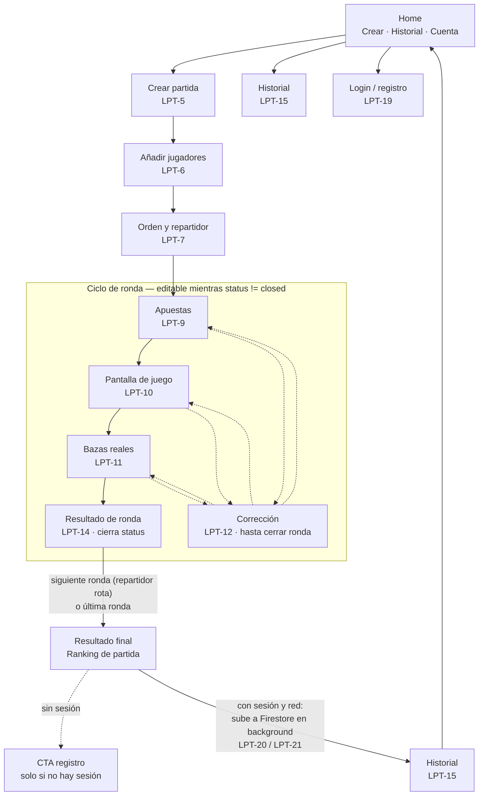
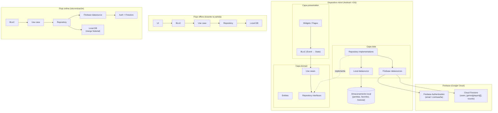
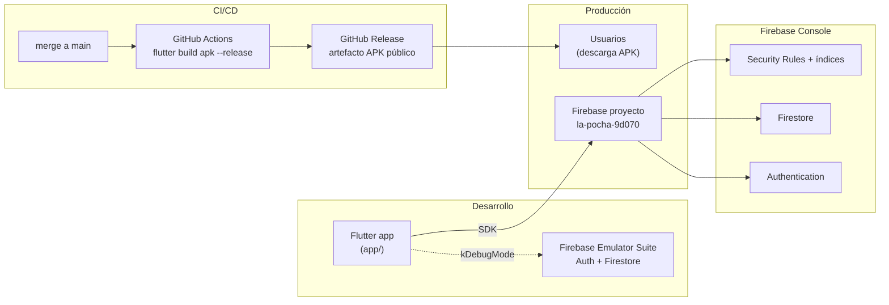
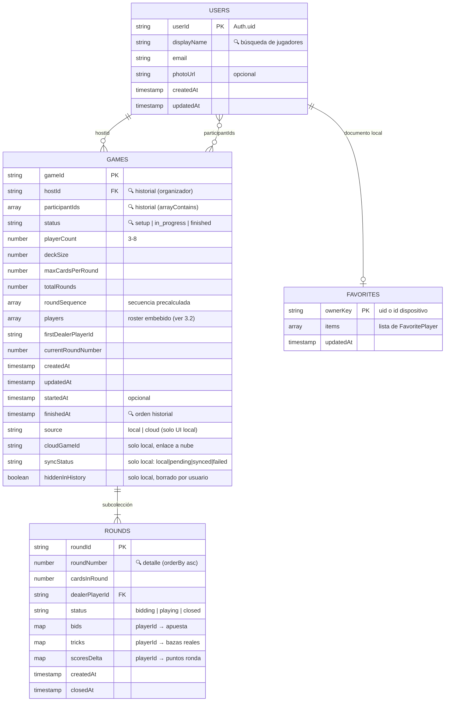

## Índice

1. [Ficha del proyecto](#0-ficha-del-proyecto)
2. [Descripción general del producto](#1-descripción-general-del-producto)
3. [Arquitectura del sistema](#2-arquitectura-del-sistema)
4. [Modelo de datos](#3-modelo-de-datos)
5. [Especificación de la API](#4-especificación-de-la-api)
6. [Historias de usuario](#5-historias-de-usuario)
7. [Tickets de trabajo](#6-tickets-de-trabajo)
8. [Pull requests](#7-pull-requests)

---

## 0. Ficha del proyecto

### **0.1. Tu nombre completo:**

  Juan Miguel Grau Sánchez

### **0.2. Nombre del proyecto:**

La Pocha Tracker

### **0.3. Descripción breve del proyecto:**

App móvil Flutter para llevar el marcador del juego de cartas español La Pocha. 
Gestiona la secuencia de rondas, calcula puntos automáticamente y valida la restricción del repartidor. 
Funciona offline y permite sincronizar el historial de partidas en la nube entre jugadores registrados.

### **0.4. URL del proyecto:**

> Puede ser pública o privada, en cuyo caso deberás compartir los accesos de manera segura. Puedes enviarlos a [alvaro@lidr.co](mailto:alvaro@lidr.co) usando algún servicio como [onetimesecret](https://onetimesecret.com/).


### 0.5. URL o archivo comprimido del repositorio

[https://github.com/juanmigrau/AI4Devs-finalproject/tree/finalproject-entrega2-JMGS](https://github.com/juanmigrau/AI4Devs-finalproject/tree/finalproject-entrega2-JMGS)

---


## 1. Descripción general del producto

**La Pocha** es una aplicación móvil (Flutter, Android e iOS) que digitaliza el marcador del juego de cartas español homónimo. Sustituye el papel y el lápiz por un flujo guiado que calcula puntos automáticamente, valida la restricción del repartidor y conserva un historial consultable. El problema que aborda es doble: llevar la puntuación a mano es lento y propenso a errores de cálculo, y al terminar la partida no queda un registro fiable de cómo evolucionó. La app mantiene la agilidad del juego físico mientras centraliza el estado de la partida en un único dispositivo.

### Propuesta de valor principal

- **Para el organizador:** elimina el cálculo manual de puntos y valida la restricción del repartidor en tiempo real, reduciendo conflictos y errores.
- **Para todos los jugadores:** el estado de la partida (apuestas, bazas disponibles, ranking) es visible y legible sin interpretar un papel lleno de tachones.
- **Para jugadores registrados:** historial de partidas compartido automáticamente en la nube entre participantes, sin pasos adicionales al finalizar.


### **1.1. Objetivo**

Digitalizar la experiencia de marcador de La Pocha para grupos de 3 a 8 jugadores que se reúnen de forma habitual u ocasional. El MVP prioriza velocidad de uso durante la partida (offline en el dispositivo host), corrección de errores en la ronda actual y sincronización opcional vía Firebase al cerrar la partida.

### **1.2. Características y funcionalidades principales (MVP)**

- Creación y configuración de partida (3–8 jugadores, cartas y secuencia de rondas automáticas).
- Flujo completo de ronda: apuestas rotativas → juego → bazas reales → cálculo de puntos y ranking.
- Validación en tiempo real de la restricción del repartidor; bloqueo si las apuestas son inválidas.
- Corrección de datos en la ronda actual y opción de repetir ronda completa.
- Jugadores por nombre libre, búsqueda de usuarios registrados y lista de favoritos local.
- Historial unificado (local y nube) con detalle ronda a ronda y función «repetir partida».
- Registro opcional (email/contraseña); subida automática al finalizar y distribución a participantes registrados.


### Flujo E2E prioritario

El organizador crea una partida nueva, define jugadores (nombre libre y/o usuarios registrados) y designa el primer repartidor. La app genera la secuencia de rondas; en cada una recoge apuestas en orden (repartidor al final), muestra bazas disponibles y número prohibido, y tras el juego físico registra las bazas reales para calcular el resultado. Al terminar la última ronda se muestra el ranking final; si el organizador tiene cuenta, la partida se sube a la nube y los jugadores registrados la ven en su historial sin acción adicional.

### **1.3. Diseño y experiencia de usuario:**

El diagrama siguiente documenta el flujo de navegación completo del MVP: desde
Home hasta el ciclo de ronda (apuestas → juego → bazas → resultado), pasando
por la corrección de datos y el cierre de partida con sincronización opcional.
Diseñado en sesión de arquitectura previa a la implementación de los tickets
del Bloque 1 y 2 (ver `listOfPrompts.md`).




**Notas de diseño:**

- **Home** es la pantalla mínima del MVP: acceso a crear partida, ver historial
y gestionar cuenta. La app funciona igual con o sin sesión (PRD §6), por lo
que el acceso a cuenta es discreto, no un bloqueo de entrada.
- **Registro contextual:** el CTA de registro aparece al finalizar una partida
sin sesión activa, como invitación a guardar el historial en la nube — nunca
como requisito antes de jugar.
- **Corrección de datos (LPT-12):** disponible desde cualquiera de las tres
pantallas activas del ciclo de ronda (apuestas, juego, bazas) mientras
`round.status != closed`. Al cerrarse la ronda (tras calcular `scoresDelta`
en LPT-11/14), la corrección puntual deja de estar disponible; solo cabe
repetir la ronda completa (LPT-13, post-MVP de esta entrega).
- **Pantallas pendientes de wireframe visual** (Stitch/Figma): Home, Crear
partida, Añadir jugadores, Orden y repartidor, Apuestas, Pantalla de juego,
Bazas reales, Resultado de ronda, Resultado final, Login/registro, Historial.


### **1.4. Instrucciones de instalación:**


### **1.4. Instrucciones de instalación:**


#### Requisitos previos

- Flutter SDK 3.x ([flutter.dev/docs/get-started/install](https://flutter.dev/docs/get-started/install))
- Dart SDK (incluido con Flutter)
- Android Studio o VS Code con extensión Flutter/Dart
- Node.js + Firebase CLI: `npm install -g firebase-tools`
- Cuenta de Firebase con acceso al proyecto `la-pocha-9d070`
- Java 17 (requerido por Gradle — usar Android Studio JBR o instalar independientemente)


#### 1. Clonar el repositorio

```bash
git clone https://github.com/juanmigrau/AI4Devs-finalproject.git
cd AI4Devs-finalproject
git checkout feature-entrega2-JMGS
```


#### 2. Instalar dependencias Flutter

```bash
cd app
flutter pub get
```


#### 3. Configurar Firebase

Los ficheros `firebase_options.dart` y `google-services.json` están en
`.gitignore` por seguridad. Hay que regenerarlos localmente:

```bash
# Autenticarse en Firebase (solo la primera vez)
firebase login

# Regenerar configuración para Android e iOS
flutterfire configure --project=la-pocha-9d070 --platforms=android,ios --yes
```

Esto genera automáticamente:

- `app/lib/firebase_options.dart`
- `app/android/app/google-services.json`
- `app/ios/Runner/GoogleService-Info.plist`

> **Nota:** Ambos ficheros deben tener el mismo `apiKey` para evitar el error
> `[core/duplicate-app]`. Si aparece ese error, vuelve a ejecutar
> `flutterfire configure`.


#### 4. Generar código de Drift (SQLite)

```bash
cd app
dart run build_runner build --delete-conflicting-outputs
```

Esto regenera `app_database.g.dart` a partir del esquema de tablas definido.

#### 5. Ejecutar la app

```bash
# En dispositivo físico Android (modo debug)
flutter run

# En emulador Android
flutter run -d emulator-5554

# Con secuencia de rondas reducida para testing (6 rondas en vez de 22)
# Primero editar app/lib/core/config/debug_config.dart:
# const bool kShortGameMode = kDebugMode && true;
flutter run
```


#### 6. Ejecutar tests

```bash
cd app

# Tests unitarios y de BLoC
flutter test

# Test de integración contra Firebase real (requiere credenciales)
flutter test test/integration/game_sync_firestore_test.dart \
  --dart-define=TEST_FIREBASE_EMAIL=tu@email.com \
  --dart-define=TEST_FIREBASE_PASSWORD=tupassword

# Análisis estático
flutter analyze
```


#### 7. Desplegar reglas Firestore (opcional)

Solo necesario si se modifican `firestore.rules` o `firestore.indexes.json`:

```bash
firebase deploy --only firestore:rules,firestore:indexes
```


#### Distribución (APK de release)

La distribución del MVP es un APK instalado directamente en dispositivo
Android, sin pasar por tiendas de aplicaciones. Para generar el APK
de release manualmente:

```bash
cd app
flutter build apk --release
# El APK se genera en build/app/outputs/flutter-apk/app-release.apk
```

Para instalarlo en un dispositivo Android con depuración USB habilitada:

```bash
flutter install
# O manualmente: adb install build/app/outputs/flutter-apk/app-release.apk
```

> **Nota:** En dispositivos con MIUI/HyperOS (Xiaomi) puede ser necesario
> habilitar "Instalar apps de origen desconocido" y disponer de una SIM
> activa para la depuración inalámbrica. La depuración USB funciona sin
> estas restricciones.

---


### Decisiones de arquitectura (ADR)


| Decisión                  | Opción elegida | Alternativa descartada | Motivo                                                                                                                                                                                                                                    |
| ------------------------- | -------------- | ---------------------- | ----------------------------------------------------------------------------------------------------------------------------------------------------------------------------------------------------------------------------------------- |
| Estado inicial de partida | `setup`        | `lobby`                | "Lobby" connota sala de espera multijugador (varios dispositivos); La Pocha es single-device. `setup` refleja el flujo real: configuración de jugadores y repartidor antes de empezar.                                                    |
| Almacenamiento local      | Drift (SQLite) | Hive                   | Drift ofrece tipado fuerte, migraciones formales y BD en memoria para tests de repositorio. La tabla `rounds` con FK `gameId` e índice `roundNumber` replica exactamente la subcolección Firestore, simplificando los mappers en `data/`. |


---


## 2. Arquitectura del Sistema


### **2.1. Diagrama de arquitectura**

La aplicación sigue **Clean Architecture** con gestión de estado mediante el patrón **BLoC** (`flutter_bloc`). Un único dispositivo actúa como host durante la partida; todo el marcador funciona offline y la conectividad solo interviene al sincronizar con la nube (registro, login y subida de partidas finalizadas).




**Escenario offline.** El organizador crea y juega la partida completa sin conexión. Los eventos de la UI llegan al BLoC, que delega en use cases de dominio (cálculo de rondas, validación del repartidor, puntuaciones). Los repositorios persisten y leen exclusivamente del almacenamiento local: partida en curso, favoritos e historial propio.

**Escenario online.** Con conectividad y usuario autenticado, al finalizar la partida el repositorio escribe en Firestore el documento `games/{gameId}` (con el roster `players[]` embebido) y la subcolección `rounds`, y actualiza el historial local. El login y la búsqueda de usuarios registrados pasan por Firebase Authentication y la colección `users`. Los participantes registrados reciben la partida en su historial mediante lecturas de Firestore gobernadas por Security Rules.

**Por qué Clean Architecture.** Separa la lógica de negocio (dominio puro: secuencia de rondas, restricción del repartidor, cálculo de puntos) de Flutter y de Firebase. La capa `presentation` no importa SDKs de Firebase; los cambios en Firestore o en la persistencia local no obligan a reescribir widgets ni BLoCs. Facilita el TDD sobre use cases y repositorios mockeados.

**Por qué BLoC.** Modela flujos con muchos estados intermedios (apuestas rotativas, validación en tiempo real, correcciones en ronda actual) de forma predecible: eventos inmutables, estados explícitos y pruebas con `bloc_test`. `BlocListener` concentra efectos secundarios (navegación, mensajes) y `BlocBuilder` limita los rebuilds de la UI.

**Beneficios.** Testabilidad por capas, soporte offline-first alineado con el PRD, y contrato de datos documentado en `firebase-data-access.yml` sin capa REST intermedia.

**Sacrificios.** Más carpetas y archivos por feature que en un enfoque monolítico; curva de aprendizaje de BLoC frente a `setState`; la sincronización local↔nube exige diseño explícito en la capa `data` (no hay backend propio que lo resuelva).

### **2.2. Descripción de componentes principales**


| Componente                     | Tecnología                                                       | Responsabilidad                                                                                                                                                                                                                                                                                                                                                                 |
| ------------------------------ | ---------------------------------------------------------------- | ------------------------------------------------------------------------------------------------------------------------------------------------------------------------------------------------------------------------------------------------------------------------------------------------------------------------------------------------------------------------------- |
| **App Flutter**                | Flutter (Dart ^3.12), Material/Cupertino                         | Cliente único para Android e iOS; host de la partida en un solo dispositivo.                                                                                                                                                                                                                                                                                                    |
| **Presentation**               | `flutter_bloc`, `equatable`, widgets Flutter                     | Pantallas, componentes reutilizables, BLoCs (`*Event`, `*State`), navegación (`go_router` cuando aplique).                                                                                                                                                                                                                                                                      |
| **Domain**                     | Dart puro                                                        | Entidades (`Game`, `Round`, `Player`, `User`), use cases (`CreateGame`, `SubmitBids`, `SyncFinishedGame`…), interfaces de repositorio. Sin dependencias de Flutter ni Firebase.                                                                                                                                                                                                 |
| **Data — local**               | Drift (SQLite) — `drift` + `drift_flutter_libs`                  | Partidas en curso, historial local, favoritos; fuente de verdad durante el juego offline. Tablas: `games` (con columnas JSON para `players[]` y `roundSequence[]`), `rounds` (FK `gameId`, índice compuesto `gameId + roundNumber`), `favorites` (columna JSON `items[]`). Campos tipo map (`bids`, `tricks`, `scoresDelta`) serializados como `TEXT` mediante `TypeConverter`. |
| **Data — remota**              | FlutterFire: `firebase_core`, `cloud_firestore`, `firebase_auth` | Autenticación, perfiles `users/{uid}`, partidas `games/{gameId}` con roster `players[]` embebido y subcolección `rounds`.                                                                                                                                                                                                                                                       |
| **Repositorios**               | Implementaciones en `data/repositories/`                         | Orquestan local y remoto: leen/escriben local siempre; suben a Firestore al cerrar partida si hay sesión; mapean DTOs ↔ entidades de dominio.                                                                                                                                                                                                                                   |
| **Firebase Authentication**    | Email y contraseña                                               | Registro opcional, login, `authStateChanges` para guards de navegación y subida automática al finalizar.                                                                                                                                                                                                                                                                        |
| **Cloud Firestore**            | Base de datos documental                                         | Persistencia en nube e historial compartido entre jugadores registrados vinculados a la partida.                                                                                                                                                                                                                                                                                |
| **Firebase CLI / FlutterFire** | `firebase-tools`, `flutterfire configure`                        | Proyecto `la-pocha-9d070`, `firebase_options.dart`, despliegue de reglas e índices.                                                                                                                                                                                                                                                                                             |
| **Inyección de dependencias**  | Constructor / `get_it` o `Provider` en raíz                      | BLoCs reciben use cases; use cases reciben interfaces de repositorio; no se inyectan datasources en presentation.                                                                                                                                                                                                                                                               |


### **2.3. Descripción de alto nivel del proyecto y estructura de ficheros**

El código de la app vive en `app/`. Bajo `lib/` cada **feature** agrupa las tres capas de Clean Architecture; la carpeta `core/` concentra elementos transversales.

```text
app/lib/
├── main.dart                 # Punto de entrada, Firebase init, DI raíz
├── firebase_options.dart     # Config generada por FlutterFire (no editar a mano)
├── core/
│   ├── router/               # go_router, rutas y guards de auth
│   ├── theme/                # Tema claro/oscuro, tokens visuales
│   ├── di/                   # Registro de dependencias (get_it)
│   ├── error/                # Failures y mapeo de excepciones
│   └── utils/                # Helpers puros compartidos
└── features/
    ├── auth/
    │   ├── presentation/       # LoginPage, RegisterPage, AuthBloc
    │   ├── domain/           # AuthRepository (abstract), SignIn, SignUp…
    │   └── data/             # AuthFirestoreDatasource, AuthRepositoryImpl
    ├── game/
    │   ├── presentation/     # Flujo de partida y rondas, GameBloc, RoundBloc
    │   ├── domain/           # Entidades Game/Round, use cases de marcador
    │   └── data/             # Drift datasource + Firestore datasources, mappers
    ├── players/
    │   ├── presentation/     # Selección de jugadores, favoritos
    │   ├── domain/
    │   └── data/
    ├── history/
    │   ├── presentation/     # Lista unificada local/nube, detalle, repetir partida
    │   ├── domain/
    │   └── data/
    └── favorites/
        ├── presentation/
        ├── domain/           # Solo persistencia local (PRD)
        └── data/
```


| Carpeta                            | Descripción                                                                                            |
| ---------------------------------- | ------------------------------------------------------------------------------------------------------ |
| `core/`                            | Infraestructura compartida: routing, tema, DI y errores; sin lógica de negocio de features.            |
| `features/<feature>/presentation/` | UI y BLoC; escucha use cases vía eventos; no importa `cloud_firestore` ni `firebase_auth`.             |
| `features/<feature>/domain/`       | Reglas de negocio y contratos; testeable sin emulador ni dispositivo.                                  |
| `features/<feature>/data/`         | Única capa con SDK Firebase y Drift (SQLite); modelos DTO, mappers y `TypeConverter` para campos JSON. |


Convención de nombres: `game_bloc.dart`, `game_event.dart`, `game_state.dart`, `game_repository.dart` (interfaz en domain, impl en data).

### **2.4. Infraestructura y despliegue**




**Infraestructura Firebase**

- **Proyecto:** `la-pocha-9d070` (Android, iOS y web registrados en consola).
- **Authentication:** proveedor email/contraseña para registro opcional.
- **Firestore:** colecciones `users`, `games` (roster `players[]` embebido en el documento) y subcolección `rounds` bajo cada partida (ver §3 y `ai-specs/specs/data-model.md`).
- **Configuración en repo:** `app/firebase.json`, `.firebaserc`, `firestore.rules`, `firestore.indexes.json` (reglas e índices se despliegan con Firebase CLI).
- **Emuladores:** desarrollo local con `firebase emulators:start --only auth,firestore` para no escribir en producción.

**Despliegue de la app Flutter**

La distribución del MVP es un **APK de release** publicado en **GitHub Releases**, no en tiendas de aplicaciones.

1. **Preparación local (desarrollo):** `cd app && flutter pub get`; `flutterfire configure` si cambia el proyecto Firebase; `flutter analyze` y `flutter test`.
2. **CI/CD:** al hacer **merge a** `main`, un workflow de **GitHub Actions** ejecuta `flutter build apk --release` y sube el APK como artefacto de un **GitHub Release** con URL pública de descarga.
3. **Instalación:** los usuarios descargan el APK desde la página de Releases del repositorio e instalan la app en Android (habilitando «orígenes desconocidos» si el dispositivo lo requiere).
4. **Firebase backend:** `firebase deploy --only firestore:rules,firestore:indexes` tras cambios de esquema o permisos (manual o pipeline acordado por el equipo).

No hay servidor Node/Express ni base de datos relacional: el backend es Firebase gestionado.

### **2.5. Seguridad**


| Área                         | Práctica                                                                                                                                                                                                                                                                  |
| ---------------------------- | ------------------------------------------------------------------------------------------------------------------------------------------------------------------------------------------------------------------------------------------------------------------------- |
| **Firebase Authentication**  | Identidad centralizada; `userId == Auth.uid` en perfiles Firestore; cierre de sesión y refresco de token en capa `data`, no solo en UI.                                                                                                                                   |
| **Firestore Security Rules** | Fuente de verdad de permisos: lectura/escritura según `request.auth.uid`, rol de host (`hostId`) y pertenencia (`participantIds`) en `games`, más acceso a la subcolección `rounds`. Las reglas se versionan en `firestore.rules` y se prueban con el emulador de reglas. |
| **Capa presentation**        | No se confía en ocultar botones como única protección; toda operación sensible debe fallar en servidor si las reglas lo impiden.                                                                                                                                          |
| **Datos locales**            | Partidas y favoritos en almacenamiento del dispositivo (sandbox de la app). Sin credenciales de Firebase embebidas más allá de `firebase_options.dart` (config pública de cliente).                                                                                       |
| **Secretos**                 | No commitear cuentas de servicio ni claves privadas; `flutterfire configure` para opciones por plataforma; archivos sensibles (`firebase_options.dart`, keystores) según `.gitignore` y política del equipo.                                                              |
| **Transporte**               | TLS gestionado por los SDK de Firebase; sin API REST propia que mantener.                                                                                                                                                                                                 |
| **Tests**                    | Tests automatizados contra emuladores, nunca contra producción con datos reales de usuarios.                                                                                                                                                                              |


Ejemplo de intención de regla (ilustrativo): solo el host autenticado puede crear `games/{gameId}` con `hostId == request.auth.uid`; un jugador registrado solo lee partidas donde su `uid` figura en `participantIds` o coincide con `hostId` (derivado del array embebido `players[]` al subir).

### **2.6. Tests**

Estrategia alineada con TDD y `mobile-standards.mdc`:


| Nivel                               | Qué se prueba                                    | Herramientas                                   | Ejemplos en La Pocha                                                                                                                                                  |
| ----------------------------------- | ------------------------------------------------ | ---------------------------------------------- | --------------------------------------------------------------------------------------------------------------------------------------------------------------------- |
| **Unitarios (domain)**              | Lógica pura sin I/O                              | `flutter test`, `package:test`                 | Secuencia de rondas (ascenso, plateau, descenso); cálculo de puntos; validación de restricción del repartidor; generación de bazas disponibles.                       |
| **Unitarios (data)**                | Mappers y repositorios con datasources mockeados | `mockito` / `mocktail`, `fake_cloud_firestore` | `GameRepositoryImpl` persiste local y delega subida a Firestore; mapeo `Game` ↔ documento Firestore.                                                                  |
| **Integración (BLoC + repository)** | Flujo evento → estado con dependencias dobladas  | `bloc_test`                                    | `GameBloc`: cerrar apuestas bloqueadas si viola restricción; `HistoryBloc`: fusionar listado local y nube.                                                            |
| **Widget**                          | Renderizado e interacción aislada                | `flutter_test`, `pumpWidget`                   | Formulario de apuestas, indicador de bazas restantes, lista de historial con icono local/nube.                                                                        |
| **E2E (flujo principal)**           | Camino completo del PRD                          | `integration_test/`, emuladores Firebase       | Organizador crea partida de 4 jugadores → 22 rondas con puntuaciones correctas → resultado final → subida a Firestore si hay cuenta → jugador vinculado ve historial. |


**Comandos habituales**

```bash
cd app
flutter test                    # unitarios + widget + bloc_test
flutter test integration_test/  # E2E (Auth/Firestore en emulador)
flutter analyze
```

Los BLoCs se prueban con use cases mockeados, no con Firebase real. Los flujos E2E que tocan Auth o Firestore usan **Firebase Emulator Suite** en `kDebugMode`.

---


## 3. Modelo de Datos

El modelo sigue un enfoque **offline-first**: toda partida, ronda y favorito existe primero en el almacenamiento local del dispositivo; Firestore solo recibe copias de partidas **finalizadas** cuando el organizador tiene sesión y conectividad. El esquema local **replica** la estructura de Firestore para simplificar mapeos en la capa `data`. El roster de jugadores se modela como array `players[]` **embebido** en el documento `games` (no hay subcolección `players`).

**Convención de consultas:** en el diagrama y las tablas, los campos marcados con **🔍** se usan en filtros u ordenación (historial por usuario, detalle de partida).

### **3.1. Diagrama del modelo de datos:**




**Rutas Firestore (nube):** `users/{userId}`, `games/{gameId}`, `games/{gameId}/rounds/{roundId}`.

**Rutas locales (dispositivo):** mismas entidades `games` y `rounds` (anidadas o por `gameId`), más `favorites/{ownerKey}`. La colección `users` en local solo cachea perfiles consultados para búsqueda; el perfil canónico del usuario autenticado vive en Firestore.

**Estructura embebida** `players[]` **dentro de** `games`**:**


| Campo         | Tipo      | Descripción                                             |
| ------------- | --------- | ------------------------------------------------------- |
| `id`          | string    | Identificador del jugador en la partida (`playerId`)    |
| `displayName` | string    | Nombre visible en mesa                                  |
| `userId`      | string?   | `null` si es invitado; `users/{uid}` si está registrado |
| `isGuest`     | boolean   | `true` si se añadió por nombre libre                    |
| `seatOrder`   | number    | Orden en mesa (0…n−1)                                   |
| `totalScore`  | number    | Puntuación acumulada al cierre de la partida            |
| `joinedAt`    | timestamp | Alta en el roster                                       |


**Estructura embebida** `items[]` **dentro de** `favorites`**:**


| Campo         | Tipo      | Descripción                                    |
| ------------- | --------- | ---------------------------------------------- |
| `id`          | string    | UUID del favorito                              |
| `displayName` | string    | Nombre para reutilizar en futuras partidas     |
| `userId`      | string?   | Opcional, si el favorito es usuario registrado |
| `createdAt`   | timestamp | Fecha de alta en favoritos                     |


### **3.2. Descripción de entidades principales:**


#### `users` — Perfiles de usuario registrado

**Ruta Firestore:** `users/{userId}` · **ID de documento:** `userId == Firebase Auth uid`.


| Campo         | Tipo      | Descripción                                                   |
| ------------- | --------- | ------------------------------------------------------------- |
| `displayName` | string    | Nombre visible al buscar jugadores registrados en una partida |
| `email`       | string    | Email de la cuenta (reflejo del proveedor Auth)               |
| `photoUrl`    | string?   | URL de avatar opcional                                        |
| `createdAt`   | timestamp | Alta del perfil en Firestore                                  |
| `updatedAt`   | timestamp | Última actualización del perfil                               |


**Relaciones:**

- **1:N** con `games` como anfitrión (`games.hostId`).
- **N:M** lógica con `games` vía `games.participantIds` cuando el usuario participa como jugador registrado.
- **1:1** local con `favorites/{ownerKey}` cuando `ownerKey == userId`.

**Restricciones y validación:**

- Solo el propio `userId` autenticado puede crear o actualizar su documento (Security Rules).
- `displayName` obligatorio y no vacío.
- Un documento por usuario autenticado.

**Índices y consultas (🔍):**


| Campo(s)      | Uso                                                                                                                             |
| ------------- | ------------------------------------------------------------------------------------------------------------------------------- |
| `displayName` | Búsqueda de usuarios registrados al añadir jugadores (prefijo o filtro en cliente; índice simple si se usa `where` + `orderBy`) |


---


#### `games` — Sesiones de partida (local y nube)

**Ruta Firestore:** `games/{gameId}` · **Ruta local:** documento equivalente en almacenamiento del dispositivo.

Representa una partida completa: configuración, roster embebido, estado y metadatos de sincronización. Las partidas en curso y el historial local existen **siempre** en el dispositivo antes de cualquier escritura en Firestore.


| Campo                 | Tipo        | Descripción                                                                                                                                 |
| --------------------- | ----------- | ------------------------------------------------------------------------------------------------------------------------------------------- |
| `hostId`              | string?     | 🔍 `userId` del organizador que creó la partida; `null` en partidas locales sin cuenta                                                      |
| `participantIds`      | arraystring | 🔍 IDs de usuarios **registrados** que participan; se rellena al subir a Firestore para consultas de historial compartido (`arrayContains`) |
| `status`              | string      | 🔍 `setup`, `in_progress`, `finished`                                                                                                       |
| `playerCount`         | number      | Número de jugadores configurado (3–8, según PRD)                                                                                            |
| `deckSize`            | number      | Cartas del mazo (30, 40, 48 o 49 según jugadores)                                                                                           |
| `maxCardsPerRound`    | number      | Máximo de cartas por ronda (M del PRD)                                                                                                      |
| `totalRounds`         | number      | Total de rondas de la secuencia (p. ej. 22 con 4 jugadores)                                                                                 |
| `roundSequence`       | arraynumber | Secuencia precalculada (ascenso, plateau, descenso)                                                                                         |
| `players`             | arraymap    | Roster embebido; ver tabla en §3.1                                                                                                          |
| `firstDealerPlayerId` | string      | `playerId` del primer repartidor                                                                                                            |
| `currentRoundNumber`  | number      | Ronda activa durante `in_progress`                                                                                                          |
| `createdAt`           | timestamp   | Creación de la partida                                                                                                                      |
| `updatedAt`           | timestamp   | Última modificación                                                                                                                         |
| `startedAt`           | timestamp?  | Paso de `setup` a `in_progress`                                                                                                             |
| `finishedAt`          | timestamp?  | 🔍 Cierre de la última ronda; orden del historial                                                                                           |
| `source`              | string      | Solo local: `local` o `cloud` (icono en listado unificado)                                                                                  |
| `cloudGameId`         | string?     | Solo local: ID del documento en Firestore tras subida exitosa                                                                               |
| `syncStatus`          | string?     | Solo local: `local`, `pending`, `synced`, `failed`                                                                                          |
| `hiddenInHistory`     | boolean     | Solo local: `true` si el usuario eliminó la partida de **su** historial                                                                     |


**Relaciones:**

- **N:1** → `users` vía `hostId` (organizador).
- **N:M** → `users` vía `participantIds` (jugadores registrados vinculados).
- **1:N** → subcolección `rounds` (detalle ronda a ronda; no array embebido).
- Cada elemento de `players[]` puede referenciar opcionalmente `users/{userId}`.

**Restricciones y validación:**

- `playerCount` entre 3 y 8 (MVP).
- `players.length` debe coincidir con `playerCount` antes de iniciar la partida.
- Sin `userId` duplicado dentro del mismo `players[]`.
- `roundSequence` generada automáticamente según reglas del PRD (patrón ascendente, plateau de M cartas durante `playerCount` rondas, descenso).
- Solo partidas con `status == finished` aparecen en el historial.
- **Borrado por usuario:** en local se marca `hiddenInHistory: true` o se elimina el documento local; en nube **no** se borra el documento para otros participantes (PRD: eliminación solo del historial propio).
- Al subir a Firestore: `hostId == Auth.uid`, `participantIds` calculado desde `players[].userId` no nulos.

**Índices y consultas (🔍):**


| Colección | Campo(s)                                              | Uso                                   |
| --------- | ----------------------------------------------------- | ------------------------------------- |
| `games`   | `hostId` + `finishedAt` desc                          | Historial del organizador             |
| `games`   | `participantIds` `array-contains` + `finishedAt` desc | Historial del participante registrado |
| `games`   | `status` + `finishedAt` desc                          | Filtrar partidas finalizadas          |
| `games`   | `gameId` (documento)                                  | Detalle de partida                    |


---


#### `games/{gameId}/rounds` — Detalle de cada ronda

**Ruta:** subcolección bajo el documento padre `games/{gameId}` (Firestore y local).

Cada ronda almacena apuestas, bazas reales y puntuación parcial. **No** se modela como array dentro de `games` para permitir consultas ordenadas y escrituras granulares durante la partida.


| Campo            | Tipo              | Descripción                                                           |
| ---------------- | ----------------- | --------------------------------------------------------------------- |
| `roundNumber`    | number            | 🔍 Orden secuencial (1…`totalRounds`); clave de ordenación en detalle |
| `cardsInRound`   | number            | Cartas repartidas en esta ronda (valor de `roundSequence`)            |
| `dealerPlayerId` | string            | `playerId` del repartidor de la ronda                                 |
| `status`         | string            | `bidding`, `playing`, `closed`                                        |
| `bids`           | mapstring, number | Apuesta por jugador (`playerId` → bazas apostadas)                    |
| `tricks`         | mapstring, number | Bazas reales por jugador tras el juego físico                         |
| `scoresDelta`    | mapstring, number | Puntos ganados o perdidos en la ronda por jugador                     |
| `createdAt`      | timestamp         | Apertura de la ronda                                                  |
| `closedAt`       | timestamp?        | Cierre tras calcular `scoresDelta`                                    |


**Relaciones:**

- **N:1** → documento padre `games/{gameId}`.
- `dealerPlayerId`, claves de `bids`, `tricks` y `scoresDelta` referencian `players[].id` del juego padre.

**Restricciones y validación:**

- `roundNumber` único por partida.
- Suma de `bids` debe igualar `cardsInRound` al cerrar apuestas.
- Restricción del repartidor: la apuesta del repartidor no puede hacer que la suma de apuestas iguale `cardsInRound` (validación en dominio antes de cerrar).
- Correcciones solo en la ronda con `status != closed` o en la ronda actual según PRD.
- Al cerrar ronda: actualizar `players[].totalScore` en el documento padre `games`.

**Índices y consultas (🔍):**


| Colección               | Campo(s)              | Uso                              |
| ----------------------- | --------------------- | -------------------------------- |
| `games/{gameId}/rounds` | `roundNumber` asc     | Detalle de partida ronda a ronda |
| `games/{gameId}/rounds` | `roundId` (documento) | Lectura de ronda concreta        |


---


#### `favorites` — Jugadores favoritos (solo local)

**Ruta local:** `favorites/{ownerKey}` · **Firestore:** no se sincroniza en el MVP (PRD: lista de favoritos almacenada en local).

Un **documento por usuario** (o por identidad de dispositivo si no hay cuenta). Contiene la lista completa de jugadores frecuentes para reutilizar al crear partidas.


| Campo       | Tipo      | Descripción                                                               |
| ----------- | --------- | ------------------------------------------------------------------------- |
| `ownerKey`  | string    | PK: `Auth.uid` si hay sesión; identificador de dispositivo si es invitado |
| `items`     | arraymap  | Lista de favoritos; ver estructura en §3.1                                |
| `updatedAt` | timestamp | Última modificación de la lista                                           |


**Relaciones:**

- **N:1** lógica → `users` cuando `ownerKey` coincide con `userId` autenticado.
- Cada `items[].userId` opcional referencia `users/{userId}` para pre-rellenar jugadores registrados.

**Restricciones y validación:**

- Sin duplicados: mismo `userId` o mismo `displayName` (insensible a mayúsculas) no puede repetirse en `items`.
- CRUD completo sin conexión (salvo búsqueda de usuario registrado al añadir).
- Sin límite de favoritos en MVP.

**Índices y consultas:**

- Acceso por clave de documento `ownerKey` (lectura/escritura directa); no requiere índices compuestos en Firestore.

---


#### Resumen de relaciones y principios de diseño


| Principio                | Aplicación                                                                                                                                                   |
| ------------------------ | ------------------------------------------------------------------------------------------------------------------------------------------------------------ |
| **Offline-first**        | `games`, `rounds` y `favorites` se persisten en local en cuanto se crean; Firestore recibe la partida al finalizar si hay sesión.                            |
| **Historial compartido** | `participantIds` en `games` permite que jugadores registrados vean partidas sin consultas extra; el roster completo está en `players[]` del mismo documento. |
| **Borrado per-user**     | `hiddenInHistory` (local) u ocultación en consulta; el documento en nube permanece para el resto de participantes.                                           |
| **Rondas desacopladas**  | Subcolección `rounds`, no array embebido en `games`, para ordenación y tamaño de documento acotado.                                                          |
| **IDs estables**         | `userId == Auth.uid`; `gameId`, `roundId` y `playerId` generados como UUID en local y reutilizados al subir.                                                 |


---


## 4. Especificación de la API

Este proyecto **no expone una API REST**. Todo el acceso a datos remotos se realiza mediante el **Firebase SDK** (`firebase_auth`, `cloud_firestore`) desde la capa `data` de la app Flutter. A continuación se documentan las **tres operaciones principales** del contrato de datos, en un formato inspirado en OpenAPI pero adaptado a Firestore y Firebase Authentication.

**Convenciones**


| Concepto OpenAPI | Equivalente Firebase                                         |
| ---------------- | ------------------------------------------------------------ |
| Endpoint         | Ruta de colección/documento o método del SDK                 |
| POST / PUT       | `set()`, `update()`, `WriteBatch.commit()`                   |
| GET (lista)      | `collection().where().orderBy().get()`                       |
| GET (detalle)    | `doc().get()` o `snapshots()`                                |
| 401 / 403        | `FirebaseException` (`permission-denied`, `unauthenticated`) |
| 404              | `not-found`                                                  |


**Fuente de verdad ampliada:** `[ai-specs/specs/firebase-data-access.yml](ai-specs/specs/firebase-data-access.yml)` · **Reglas de seguridad:** `firestore.rules` (desplegadas con Firebase CLI).

---


### Operación 1 — Crear y sincronizar una partida finalizada


| Atributo          | Valor                                                                                                 |
| ----------------- | ----------------------------------------------------------------------------------------------------- |
| **Identificador** | `syncFinishedGame`                                                                                    |
| **SDK**           | `FirebaseFirestore.batch()` → `batch.set()` / `batch.commit()`                                        |
| **Tipo**          | Escritura por lotes (*batch write*)                                                                   |
| **Rutas**         | `games/{gameId}` + subcolección `games/{gameId}/rounds/{roundNumber}`                                 |
| **Disparador**    | Al cerrar la última ronda (`status == finished`) si el organizador tiene sesión activa y conectividad |


#### Descripción

Persiste en Firestore una copia completa de la partida ya jugada en local. El organizador autenticado sube el documento padre `games/{gameId}` (con el roster `players[]` embebido) y un documento por ronda en la subcolección `rounds`. La operación es **atómica**: o se escriben todos los documentos del lote o ninguno. Los jugadores registrados vinculados en `players[].userId` quedan incluidos en `participantIds` para que puedan consultar la partida en su historial (Operación 2).

**Comportamiento offline:** la partida se persiste **primero en el almacenamiento local** del dispositivo durante todo el juego. La escritura en Firestore es diferida hasta el cierre de la partida. Si no hay red o la subida falla, el documento local conserva `syncStatus: pending` y `cloudGameId` vacío; se reintenta al recuperar conectividad. La UI no bloquea el resultado final.

#### Parámetros / campos

**Cabecera implícita:** `request.auth.uid` debe coincidir con `hostId`.

**Documento** `games/{gameId}` **(obligatorios en nube):**


| Campo                 | Tipo        | Descripción                                                                                       |
| --------------------- | ----------- | ------------------------------------------------------------------------------------------------- |
| `hostId`              | string      | `Auth.uid` del organizador                                                                        |
| `participantIds`      | arraystring | `userId` de cada jugador registrado en `players[]` (sin duplicados)                               |
| `status`              | string      | `"finished"`                                                                                      |
| `playerCount`         | number      | 3–8                                                                                               |
| `deckSize`            | number      | Tamaño del mazo según jugadores                                                                   |
| `maxCardsPerRound`    | number      | Máximo de cartas por ronda (M)                                                                    |
| `totalRounds`         | number      | Longitud de la secuencia                                                                          |
| `roundSequence`       | arraynumber | Secuencia precalculada de cartas por ronda                                                        |
| `players`             | arraymap    | Roster embebido: `id`, `displayName`, `userId?`, `isGuest`, `seatOrder`, `totalScore`, `joinedAt` |
| `firstDealerPlayerId` | string      | `playerId` del primer repartidor                                                                  |
| `currentRoundNumber`  | number      | Última ronda jugada                                                                               |
| `createdAt`           | timestamp   | Creación de la partida                                                                            |
| `updatedAt`           | timestamp   | Última modificación                                                                               |
| `finishedAt`          | timestamp   | Cierre de la última ronda                                                                         |


**Documento** `games/{gameId}/rounds/{roundNumber}` **(uno por ronda, obligatorios):**


| Campo            | Tipo              | Descripción                                     |
| ---------------- | ----------------- | ----------------------------------------------- |
| `roundNumber`    | number            | Orden 1…`totalRounds` (también ID de documento) |
| `cardsInRound`   | number            | Valor de `roundSequence[roundNumber - 1]`       |
| `dealerPlayerId` | string            | Repartidor de la ronda                          |
| `status`         | string            | `"closed"`                                      |
| `bids`           | mapstring, number | `playerId` → apuesta                            |
| `tricks`         | mapstring, number | `playerId` → bazas reales                       |
| `scoresDelta`    | mapstring, number | `playerId` → puntos de la ronda                 |
| `createdAt`      | timestamp         | Apertura de la ronda                            |
| `closedAt`       | timestamp         | Cierre tras calcular puntuación                 |


**Ejemplo de invocación (Dart):**

```dart
final batch = firestore.batch();
final gameRef = firestore.collection('games').doc(gameId);

batch.set(gameRef, {
  'hostId': uid,
  'participantIds': participantIds,
  'status': 'finished',
  'playerCount': 4,
  'deckSize': 40,
  'maxCardsPerRound': 10,
  'totalRounds': 22,
  'roundSequence': [1, 2, /* … */ 1],
  'players': [ /* roster embebido */ ],
  'firstDealerPlayerId': 'player-uuid-1',
  'currentRoundNumber': 22,
  'createdAt': Timestamp.fromDate(createdAt),
  'updatedAt': FieldValue.serverTimestamp(),
  'finishedAt': Timestamp.fromDate(finishedAt),
});

for (final round in rounds) {
  batch.set(
    gameRef.collection('rounds').doc('${round.roundNumber}'),
    round.toFirestoreMap(),
  );
}

await batch.commit();
```


#### Respuesta de éxito


| Campo             | Valor                                                          |
| ----------------- | -------------------------------------------------------------- |
| **Código SDK**    | Sin excepción; `WriteBatch.commit()` resuelve                  |
| **Efecto remoto** | Documentos creados en `games/{gameId}` y `rounds/`*            |
| **Efecto local**  | `cloudGameId == gameId`, `syncStatus: synced`, `source: cloud` |


#### Casos de error


| Código / causa         | Descripción                                                                   | Acción en app                                                         |
| ---------------------- | ----------------------------------------------------------------------------- | --------------------------------------------------------------------- |
| `permission-denied`    | Reglas rechazan la escritura (`hostId` ≠ `Auth.uid` o usuario no autenticado) | `syncStatus: failed`; mensaje discreto; reintento manual o automático |
| `unauthenticated`      | Sesión expirada o cerrada                                                     | No subir; partida permanece solo local                                |
| `unavailable` / red    | Sin conectividad o timeout                                                    | `syncStatus: pending`; reintento al recuperar red                     |
| `invalid-argument`     | Datos incompletos o tipos incorrectos                                         | Corregir mapeo en datasource; log de desarrollo                       |
| Lote > 500 operaciones | Límite de Firestore por batch                                                 | Partir en varios lotes (no aplica al MVP: máx. ~22 rondas)            |


#### Regla de seguridad que aplica

```javascript
match /games/{gameId} {
  allow create: if request.auth != null
    && request.resource.data.hostId == request.auth.uid
    && request.resource.data.status == 'finished';

  allow update: if request.auth != null
    && resource.data.hostId == request.auth.uid;
}

match /games/{gameId}/rounds/{roundNumber} {
  allow create, update: if request.auth != null
    && get(/databases/$(database)/documents/games/$(gameId)).data.hostId
       == request.auth.uid;

  allow read: if request.auth != null && (
    get(/databases/$(database)/documents/games/$(gameId)).data.hostId
      == request.auth.uid
    || request.auth.uid in get(/databases/$(database)/documents/games/$(gameId))
         .data.participantIds
  );
}
```

---


### Operación 2 — Obtener historial de partidas del usuario


| Atributo          | Valor                                                                 |
| ----------------- | --------------------------------------------------------------------- |
| **Identificador** | `listUserGameHistory`                                                 |
| **SDK**           | `FirebaseFirestore.collection('games').where(...).orderBy(...).get()` |
| **Tipo**          | Consulta (*query*)                                                    |
| **Ruta**          | Colección `games`                                                     |
| **Requisito**     | Usuario autenticado (`Auth.uid`)                                      |


#### Descripción

Devuelve las partidas **finalizadas** en las que el usuario participó como organizador o como jugador registrado. La consulta en Firestore usa `participantIds` (denormalizado al subir en la Operación 1). El repositorio **fusiona** el resultado con el historial local y aplica el filtro `hiddenInHistory != true` en el dispositivo, ya que el borrado del historial propio es **solo local** y no elimina el documento en nube para otros participantes (PRD).

Para el organizador también se puede ejecutar una consulta complementaria con `hostId == uid`; el listado unificado deduplica por `cloudGameId`.

#### Parámetros / campos


| Parámetro         | Origen                                   | Descripción                                                                      |
| ----------------- | ---------------------------------------- | -------------------------------------------------------------------------------- |
| `userId`          | `FirebaseAuth.instance.currentUser!.uid` | Usuario autenticado                                                              |
| `participantIds`  | Filtro Firestore                         | `array-contains: userId`                                                         |
| `status`          | Filtro Firestore                         | `isEqualTo: 'finished'`                                                          |
| `hiddenInHistory` | Filtro **local**                         | Excluir partidas con `hiddenInHistory == true` en almacenamiento del dispositivo |
| `orderBy`         | Firestore                                | `finishedAt` descendente                                                         |
| `limit`           | Opcional                                 | Paginación con `startAfterDocument`                                              |


**Ejemplo de invocación (Dart):**

```dart
final snapshot = await firestore
    .collection('games')
    .where('participantIds', arrayContains: uid)
    .where('status', isEqualTo: 'finished')
    .orderBy('finishedAt', descending: true)
    .limit(20)
    .get();

// En el repositorio: merge con partidas locales y filtrar hiddenInHistory
```

**Índice compuesto requerido** (`firestore.indexes.json`): `participantIds` (ARRAY) + `status` (ASC) + `finishedAt` (DESC).

#### Respuesta de éxito


| Campo          | Descripción                                                                                                                                    |
| -------------- | ---------------------------------------------------------------------------------------------------------------------------------------------- |
| **Tipo**       | `QuerySnapshot<Map<String, dynamic>>`                                                                                                          |
| **Documentos** | Lista de `games/{gameId}` con resumen: `gameId`, `hostId`, `finishedAt`, `playerCount`, `players[]` (nombres y `totalScore`), `participantIds` |
| **UI**         | Listado unificado local/nube con icono diferenciador (`source`)                                                                                |


**Ejemplo de documento en la respuesta (resumido):**

```json
{
  "gameId": "a1b2c3d4-...",
  "hostId": "uid-organizador",
  "participantIds": ["uid-a", "uid-b"],
  "status": "finished",
  "playerCount": 4,
  "finishedAt": "2026-06-10T22:15:00Z",
  "players": [
    { "id": "p1", "displayName": "Juan", "userId": "uid-a", "totalScore": 12 },
    { "id": "p2", "displayName": "María", "userId": "uid-b", "totalScore": 8 }
  ]
}
```


#### Casos de error


| Código / causa        | Descripción                                                         | Acción en app                                              |
| --------------------- | ------------------------------------------------------------------- | ---------------------------------------------------------- |
| `permission-denied`   | El usuario no es `hostId` ni está en `participantIds` del documento | No mostrar esa partida; error de reglas en desarrollo      |
| `unauthenticated`     | Sin sesión                                                          | Mostrar solo historial local                               |
| `failed-precondition` | Falta índice compuesto                                              | Desplegar `firestore.indexes.json`                         |
| `unavailable` / red   | Sin conectividad                                                    | Mostrar historial local en caché; reintentar al reconectar |
| `not-found`           | Colección vacía para el usuario                                     | Lista vacía (no es error de dominio)                       |


#### Regla de seguridad que aplica

```javascript
match /games/{gameId} {
  allow read: if request.auth != null && (
    resource.data.hostId == request.auth.uid
    || request.auth.uid in resource.data.participantIds
  );
}
```

Solo lectura para participantes registrados; no pueden modificar ni borrar la partida del organizador.

---


### Operación 3 — Registro e inicio de sesión (Firebase Authentication)


| Atributo                | Valor                                                                                    |
| ----------------------- | ---------------------------------------------------------------------------------------- |
| **Identificador**       | `signUp` / `signIn`                                                                      |
| **SDK**                 | `FirebaseAuth.createUserWithEmailAndPassword`, `FirebaseAuth.signInWithEmailAndPassword` |
| **Tipo**                | Autenticación (no Firestore directamente)                                                |
| **Efecto en Firestore** | Tras registro exitoso, creación o fusión de `users/{uid}`                                |


#### Descripción

Permite el **registro opcional** con email y contraseña para habilitar la sincronización automática del historial (Operación 1) y la consulta compartida (Operación 2). El login restablece la sesión sin recrear el perfil. Tras `createUserWithEmailAndPassword`, la capa `data` escribe el documento de perfil en Firestore con `set(..., SetOptions(merge: true))`.

#### Parámetros / campos

**Registro (**`signUp`**)**


| Campo         | Tipo   | Obligatorio | Descripción                                                      |
| ------------- | ------ | ----------- | ---------------------------------------------------------------- |
| `email`       | string | sí          | Email válido; único en Firebase Auth                             |
| `password`    | string | sí          | Contraseña del proveedor (mínimo 6 caracteres en Firebase)       |
| `displayName` | string | sí          | Nombre visible al buscar jugadores; se persiste en `users/{uid}` |


**Inicio de sesión (**`signIn`**)**


| Campo      | Tipo   | Obligatorio | Descripción        |
| ---------- | ------ | ----------- | ------------------ |
| `email`    | string | sí          | Email de la cuenta |
| `password` | string | sí          | Contraseña         |


**Documento Firestore creado en registro —** `users/{uid}`**:**


| Campo         | Tipo      | Descripción               |
| ------------- | --------- | ------------------------- |
| `displayName` | string    | Nombre del usuario        |
| `email`       | string    | Reflejo del email de Auth |
| `photoUrl`    | string?   | Opcional                  |
| `createdAt`   | timestamp | Alta del perfil           |
| `updatedAt`   | timestamp | Última actualización      |


**Ejemplo de invocación (Dart):**

```dart
// Registro
final credential = await FirebaseAuth.instance
    .createUserWithEmailAndPassword(email: email, password: password);

await FirebaseFirestore.instance
    .doc('users/${credential.user!.uid}')
    .set({
      'displayName': displayName,
      'email': email,
      'createdAt': FieldValue.serverTimestamp(),
      'updatedAt': FieldValue.serverTimestamp(),
    }, SetOptions(merge: true));

// Login
await FirebaseAuth.instance
    .signInWithEmailAndPassword(email: email, password: password);
```


#### Respuesta de éxito


| Operación    | Respuesta SDK                                 | Efecto                                                                                     |
| ------------ | --------------------------------------------- | ------------------------------------------------------------------------------------------ |
| **Registro** | `UserCredential` con `user.uid`, `user.email` | Cuenta Auth creada; documento `users/{uid}` en Firestore; `authStateChanges` emite usuario |
| **Login**    | `UserCredential` con sesión activa            | Token refrescado; navegación a flujos con subida/historial en nube                         |


#### Casos de error


| Código Firebase Auth     | Operación            | Descripción                            | Mensaje orientativo (UI)                          |
| ------------------------ | -------------------- | -------------------------------------- | ------------------------------------------------- |
| `email-already-in-use`   | Registro             | El email ya está registrado            | «Este email ya tiene cuenta. Inicia sesión.»      |
| `invalid-email`          | Ambas                | Formato de email inválido              | «Introduce un email válido.»                      |
| `weak-password`          | Registro             | Contraseña demasiado débil             | «La contraseña debe tener al menos 6 caracteres.» |
| `user-not-found`         | Login                | No existe cuenta con ese email         | «No hay cuenta con este email.»                   |
| `wrong-password`         | Login                | Contraseña incorrecta                  | «Contraseña incorrecta.»                          |
| `invalid-credential`     | Login                | Credenciales inválidas (SDK unificado) | «Email o contraseña incorrectos.»                 |
| `user-disabled`          | Ambas                | Cuenta deshabilitada en consola        | «Esta cuenta no está disponible.»                 |
| `network-request-failed` | Ambas                | Sin conectividad                       | «Comprueba tu conexión e inténtalo de nuevo.»     |
| `permission-denied`      | Registro (Firestore) | Fallo al crear `users/{uid}`           | «No se pudo crear el perfil. Inténtalo de nuevo.» |


#### Regla de seguridad que aplica

**Firebase Authentication:** el proveedor email/contraseña debe estar habilitado en la consola del proyecto `la-pocha-9d070`.

**Firestore (**`users/{userId}`**):**

```javascript
match /users/{userId} {
  allow read: if request.auth != null;

  allow create, update: if request.auth != null
    && request.auth.uid == userId
    && request.resource.data.displayName is string
    && request.resource.data.displayName.size() > 0;

  allow delete: if request.auth != null && request.auth.uid == userId;
}
```

Solo el propio usuario puede crear, actualizar o eliminar su perfil; cualquier usuario autenticado puede leer perfiles (búsqueda de jugadores registrados al crear partida).

---


## 5. Historias de Usuario

> Documenta 3 de las historias de usuario principales utilizadas durante el desarrollo, teniendo en cuenta las buenas prácticas de producto al respecto.


### Historia de Usuario 1 — LPT-5: Crear partida

**Historia**

Como organizador, quiero crear una nueva partida seleccionando el número de jugadores, para que la app genere automáticamente la secuencia de rondas y el número de cartas.

**Criterios de aceptación**

1. El organizador puede seleccionar un número de jugadores entre **3 y 8** (inclusive).
2. Al cambiar el número, la UI muestra en tiempo real: **cartas totales**, **máximo de cartas por jugador por ronda** y **número total de rondas**.
3. La secuencia de rondas sigue el patrón ascendente-plateau-descendente: 1, 2, …, M (repetido N veces, siendo N el número de jugadores), M-1, …, 2, 1. Ejemplo con 4 jugadores (M=10): 1,2,3,4,5,6,7,8,9,10,10,10,10,9,8,7,6,5,4,3,2,1 = 22 rondas.
4. Al confirmar, se crea un borrador de partida en estado `setup` persistido **localmente** (offline-first) con: `playerCount`, `totalCards`, `maxCardsPerRound`, `roundSequence[]` (`roundNumber`, `cardsPerPlayer`).
5. Tras confirmar, navega a la pantalla de configuración de jugadores (LPT-6) pasando el `gameId` del borrador.
6. Si el usuario cancela o vuelve atrás sin confirmar, no se persiste ningún borrador.
7. La operación funciona **sin conexión** y sin requerir cuenta.

**Tabla de configuración (PRD §6)**


| Jugadores | Cartas totales | Máx. por ronda (M) | Rondas |
| --------- | -------------- | ------------------ | ------ |
| 3         | 30             | 10                 | 21     |
| 4         | 40             | 10                 | 22     |
| 5         | 40             | 8                  | 19     |
| 6         | 48             | 8                  | 21     |
| 7         | 49 (+ comodín) | 7                  | 19     |
| 8         | 48             | 6                  | 18     |


---


### Historia de Usuario 2 — LPT-9: Apuestas con restricción del repartidor

**Historia**

Como organizador, quiero introducir las apuestas de cada jugador en orden (repartidor al final) con validación de la restricción en tiempo real, para cerrar la fase de apuestas sin errores.

**Criterios de aceptación**

1. Las apuestas se introducen en orden de `seatOrder`, comenzando por el jugador siguiente al repartidor; el **repartidor apuesta el último**.
2. Cada apuesta es un entero entre **0** y `cardsPerPlayer` de la ronda actual (inclusive).
3. Durante la introducción se muestra en tiempo real:
  - Bazas ya apostadas (suma parcial).
  - Bazas restantes disponibles (`cardsPerPlayer - suma parcial`).
  - Para el repartidor: **número prohibido** = bazas restantes al llegar su turno.
4. **Restricción del repartidor:** la suma total de apuestas **no puede igualar** `cardsPerPlayer`. Si el repartidor intenta apostar el valor prohibido, se bloquea la confirmación con mensaje explicativo.
5. Botón "Cerrar apuestas" habilitado solo cuando todas las apuestas están registradas y la restricción se cumple.
6. Al cerrar: `round.status` pasa a `playing`; navega a pantalla de juego (LPT-10).
7. Funciona offline.

---


### Historia de Usuario 3 — LPT-11: Bazas reales y puntuación automática

**Historia**

Como organizador, quiero introducir las bazas reales obtenidas y que la app calcule los puntos automáticamente, para eliminar errores de cálculo.

**Criterios de aceptación**

1. El organizador introduce las bazas reales (0–`cardsPerPlayer`) para cada jugador.
2. **Validación:** la suma de bazas reales debe igualar `cardsPerPlayer`; no se puede confirmar si no cuadra.
3. **Cálculo de puntos por jugador:**
  - Si `bazas == apuesta`: `puntos = 10 + (5 × bazas)`
  - Si `bazas != apuesta`: `puntos = -5 × |apuesta - bazas|`
4. Se actualiza `Player.totalScore` += puntos de la ronda.
5. Se persiste en la ronda: `tricks` (map por playerId), `scoresDelta` (map por playerId), `status: closed`, `closedAt`.
6. Al confirmar, navega a pantalla de resultado (LPT-14).
7. Si no es la última ronda, LPT-14 ofrecerá avanzar a la siguiente (creando ronda con repartidor rotado).
8. Funciona offline.

---


## 6. Tickets de Trabajo

> Documenta 3 de los tickets de trabajo principales del desarrollo, uno de backend, uno de frontend, y uno de bases de datos. Da todo el detalle requerido para desarrollar la tarea de inicio a fin teniendo en cuenta las buenas prácticas al respecto.


### Ticket 1 — LPT-7: Orden de jugadores y primer repartidor (capa domain)

**Historia**

Como organizador, quiero reordenar los jugadores y elegir el primer repartidor (o asignarlo aleatoriamente), para respetar el orden físico de la mesa.

**Contexto y alcance**

Tercer paso del flujo de creación de partida (épica **Gestión de partida**), tras LPT-6. El organizador define el orden en mesa y el primer repartidor antes de iniciar la partida.

**Incluye:** reordenación drag-and-drop (o botones subir/bajar), selección manual del primer repartidor, botón "Repartidor aleatorio", persistencia de `seatOrder` y `firstDealerPlayerId`, botón "Empezar partida".

**Excluye:** flujo de rondas (LPT-9+), edición de orden una vez iniciada la partida.

**Criterios de aceptación**

1. El organizador puede reordenar la lista de jugadores mientras `status == setup`.
2. Cada jugador muestra su posición (`seatOrder` 1-based) actualizada en tiempo real al reordenar.
3. El primer repartidor por defecto es el jugador en posición 1; el organizador puede seleccionar otro tocando su fila.
4. Botón **"Repartidor aleatorio"** asigna aleatoriamente el primer repartidor entre los jugadores del roster.
5. Al pulsar **"Empezar partida"**: persiste `seatOrder` y `firstDealerPlayerId`, cambia `status` a `in_progress`, crea la primera ronda con `dealerPlayerId == firstDealerPlayerId`, navega a fase de apuestas (LPT-9).
6. No se puede empezar sin exactamente `playerCount` jugadores.
7. Funciona sin conexión y sin cuenta.

**Impacto en modelo de datos**

**Actualización local del borrador** `Game`**:**


| Campo                 | Tipo      | Descripción                        |
| --------------------- | --------- | ---------------------------------- |
| `status`              | string    | `setup` → `in_progress` al empezar |
| `firstDealerPlayerId` | string    | `playerId` del primer repartidor   |
| `startedAt`           | timestamp | Inicio de partida                  |
| `currentRoundNumber`  | number    | `1` al empezar                     |


**Actualización** `Player`**:**


| Campo       | Tipo   | Descripción                |
| ----------- | ------ | -------------------------- |
| `seatOrder` | number | Posición en mesa (1-based) |


**Primera ronda (**`Round`**):**


| Campo            | Tipo   | Descripción           |
| ---------------- | ------ | --------------------- |
| `roundNumber`    | number | `1`                   |
| `cardsPerPlayer` | number | De `roundSequence[0]` |
| `dealerPlayerId` | string | Primer repartidor     |
| `status`         | string | `bidding`             |


**Rotación de repartidor (dominio):** en rondas siguientes, `dealerPlayerId` rota según `seatOrder` (repartidor = jugador anterior en orden circular).

**Impacto en Security Rules**

Ninguno en este ticket (solo local). Documentar: transición `setup` → `in_progress` en Firestore requerirá permisos de `hostId`.

**Arquitectura y ficheros (**`lib/features/game_setup/`**)**

```
lib/features/game_setup/
  domain/
    usecases/reorder_players_usecase.dart
    usecases/set_first_dealer_usecase.dart
    usecases/randomize_first_dealer_usecase.dart
    usecases/start_game_usecase.dart
    services/dealer_rotation_service.dart
  presentation/
    bloc/game_setup_bloc.dart
    pages/game_setup_page.dart
    widgets/reorderable_player_list.dart
    widgets/dealer_selector.dart
    widgets/random_dealer_button.dart
```

**Routing:** `/games/{gameId}/setup` → `GameSetupPage`; al empezar → `/games/{gameId}/rounds/1/bids`.

**Definición de hecho**

- [ ] Tests unitarios (`dealer_rotation_service_test.dart`): rotación circular correcta.
- [ ] Tests unitarios (`start_game_usecase_test.dart`): crea ronda 1, actualiza status.
- [ ] Tests BLoC: reordenar, aleatorio, empezar partida.
- [ ] `flutter analyze` sin errores.

---


### Ticket 2 — LPT-10: Pantalla de juego (capa presentation)

**Historia**

Como organizador, quiero ver durante el juego las apuestas, puntuación acumulada y balance de bazas de cada jugador, para que todos puedan seguir el estado de la partida.

**Contexto y alcance**

Pantalla de juego durante la fase física (épica **Flujo de ronda**), tras cerrar apuestas (LPT-9). Vista de solo lectura del estado de la ronda y partida para consulta en mesa.

**Incluye:** listado de jugadores con apuesta de la ronda, puntuación acumulada total, balance de bazas (suma apostada vs `cardsPerPlayer`), indicador de repartidor, botón para pasar a introducir bazas reales (LPT-11).

**Excluye:** edición de apuestas (LPT-12), cálculo de puntos de ronda (LPT-11).

**Criterios de aceptación**

1. Tras cerrar apuestas, se muestra pantalla de juego con todos los jugadores ordenados por `seatOrder`.
2. Por cada jugador se muestra: nombre, apuesta de la ronda actual, puntuación acumulada (`totalScore`), indicador si es repartidor.
3. Cabecera o panel resumen muestra: número de ronda, cartas por jugador, **balance de bazas** (`suma apuestas / cardsPerPlayer`), confirmación visual de restricción cumplida.
4. La pantalla es de **solo lectura** (no se editan datos en esta vista).
5. Botón **"Introducir bazas"** navega a LPT-11.
6. Opción de volver a corregir apuestas (atajo a LPT-12) visible pero secundaria.
7. Funciona offline; diseño legible a distancia (tipografía grande, contraste alto — persona Carlos del PRD).

**Impacto en modelo de datos**

**Lectura desde:**

- `Round.bids`, `Round.cardsPerPlayer`, `Round.dealerPlayerId`, `Round.roundNumber`
- `Player.displayName`, `Player.totalScore`, `Player.seatOrder`

Sin escrituras en esta pantalla.

**Impacto en Security Rules**

Ninguno (solo lectura local).

**Arquitectura y ficheros (**`lib/features/round/`**)**

```
lib/features/round/
  domain/
    usecases/get_round_play_state_usecase.dart
  presentation/
    bloc/play_state_bloc.dart
    pages/play_page.dart
    widgets/player_play_card.dart
    widgets/tricks_balance_banner.dart
    widgets/round_header.dart
```

**Routing:** `/games/{gameId}/rounds/{roundNumber}/play`.

**Definición de hecho**

- [ ] Widget test: renderiza apuestas y scores correctos con datos mock.
- [ ] Tests BLoC: carga estado de ronda en `playing`.
- [ ] `flutter analyze` sin errores.

---


### Ticket 3 — LPT-20: Sincronización automática al finalizar (capa data / Firebase)

**Historia**

Como jugador registrado, quiero que mis partidas se suban automáticamente al finalizarlas, para tener mi historial disponible en la nube sin ninguna acción adicional.

**Contexto y alcance**

Épica **Cuenta y sincronización**. Tras finalizar una partida (LPT-14 `finish_game`), si el organizador tiene sesión activa y hay conectividad, la partida se sube automáticamente a Firestore sin acción manual.

**Incluye:** trigger post-finalización, escritura atómica/batch de `games`, `players` y `rounds`, vinculación `cloudGameId` en partida local, reintentos ante fallo de red, feedback UI discreto (éxito/error).

**Excluye:** subida manual de partidas locales anteriores al registro (post-MVP), sincronización durante la partida, subida si no hay sesión.

**Criterios de aceptación**

1. Al finalizar partida (`game.status == finished`), si el usuario está autenticado y hay red, se inicia subida automática en background.
2. Se crea `games/{gameId}` con `hostId == Auth.uid`, `status: finished`, metadatos y timestamps (`finishedAt`, `createdAt`, `updatedAt`).
3. Se escriben subcolecciones `players` y `rounds` con datos completos (apuestas, bazas, `scoresDelta`, `totalScore`).
4. La partida local se actualiza con `cloudGameId` y `syncStatus: synced` para deduplicación en LPT-15.
5. Si **no hay sesión** o **no hay red**: la partida queda solo local; no se muestra error bloqueante; opcional badge "pendiente de sincronizar".
6. Si la subida falla: `syncStatus: pending`, reintento al recuperar conectividad o al abrir historial.
7. **No** se suben partidas finalizadas antes del registro de forma retroactiva (PRD post-MVP).
8. El organizador no necesita pulsar ningún botón adicional.

**Impacto en modelo de datos**

**Escritura Firestore:**


| Ruta                                | Contenido                                                                           |
| ----------------------------------- | ----------------------------------------------------------------------------------- |
| `games/{gameId}`                    | `hostId`, `status`, `playerCount`, `finishedAt`, `settings` *(roundSequence, etc.)* |
| `games/{gameId}/players/{playerId}` | `userId`, `displayName`, `seatOrder`, `totalScore`                                  |
| `games/{gameId}/rounds/{roundId}`   | `roundNumber`, `dealerPlayerId`, `bids`, `tricks`, `scoresDelta`, `status: closed`  |


**Actualización partida local:**


| Campo         | Tipo   | Descripción                            |
| ------------- | ------ | -------------------------------------- |
| `cloudGameId` | string | ID del documento en Firestore          |
| `syncStatus`  | string | `local`, `pending`, `synced`, `failed` |


**Impacto en Security Rules**

```javascript
match /games/{gameId} {
  allow create: if request.auth != null
    && request.resource.data.hostId == request.auth.uid;
  allow update: if request.auth != null
    && resource.data.hostId == request.auth.uid;
  allow read: if request.auth != null && (
    resource.data.hostId == request.auth.uid
    || exists(/databases/$(database)/documents/games/$(gameId)/players/$(request.auth.uid))
  );
}
match /games/{gameId}/players/{playerId} { /* host write; participants read */ }
match /games/{gameId}/rounds/{roundId} { /* host write; participants read */ }
```

*(Ajustar membership check según modelado final de* `players`*.)*

**Firebase Auth**

Requiere sesión activa (`Auth.uid` como `hostId`). Sin Auth: no-op silencioso.

**Arquitectura y ficheros**

```
lib/features/sync/
  domain/
    entities/sync_status.dart
    repositories/game_sync_repository.dart
    usecases/upload_finished_game_usecase.dart
    usecases/retry_pending_uploads_usecase.dart
  data/
    datasources/game_firestore_datasource.dart
    datasources/game_local_datasource.dart   # extensión syncStatus/cloudGameId
    repositories/game_sync_repository_impl.dart
  presentation/
    bloc/game_sync_bloc.dart                 # opcional: estado global sync
    widgets/sync_status_snackbar.dart

lib/features/round/
  domain/usecases/finish_game_usecase.dart   # disparar upload tras finish
```

**Flujo:**

```
finish_game → if (authenticated && online) → UploadFinishedGameUseCase
           → WriteBatch Firestore → update local cloudGameId
```

**Definición de hecho**

- [ ] Tests unitarios: mapeo local → Firestore, no-op sin sesión.
- [ ] Tests unitarios: `retry_pending_uploads` con partidas `pending`.
- [ ] Tests de integración con Firestore Emulator: escritura completa de partida 4 jugadores.
- [ ] `flutter analyze` sin errores.

---


## 7. Pull Requests

> Documenta 3 de las Pull Requests realizadas durante la ejecución del proyecto

### Pull Request 1 — Entrega 1: Documentación técnica

**URL:** <https://github.com/juanmigrau/AI4Devs-finalproject/pull/1>

**Estado:** Mergeada a `main`

**Descripción:** Documentación técnica completa del proyecto: README con
arquitectura, modelo de datos, especificación de API Firebase, historias
de usuario y tickets de trabajo. Incluye PRD, reglas e índices Firestore,
configuración del proyecto Firebase y decisiones de arquitectura (Clean
Architecture + BLoC).

**Rama:** `finalproject-entrega1-JMGS` → `main`

---

### Pull Request 2 — Entrega 2: Implementación Flutter

**URL:** <https://github.com/juanmigrau/AI4Devs-finalproject/pull/2>

**Descripción:** Implementación completa del MVP: 13 tickets (LPT-5 a
LPT-24), flujo E2E funcional en dispositivo Android (Xiaomi Mi A1),
138+ tests pasando y flutter analyze limpio. Incluye wireframes generados
con Figma Make, sistema de diseño en docs/design.md, decisiones ADR
documentadas (Drift vs Hive, setup vs lobby), instrucciones de instalación
y prompts.md completo de Entrega 2.

**Rama:** `feature-entrega2-JMGS` → `main`

---

### Pull Request 3 — Entrega Final

**URL:** <https://github.com/juanmigrau/AI4Devs-finalproject/pull/3>

**Descripción:** Tickets Should-Have (LPT-8, 13, 16, 17, 18, 25),
refactor Atomic Design (PochaAppBar, PrimaryButton,
PlayerInitialAvatar, WarningBanner en core/widgets/),
rediseño de add_players_page con Claude Design, panel de
debug en runtime (DebugConfigNotifier), resolución de bugs
en Samsung A26 y Xiaomi Mi A1.

**Rama:** finalproject-entregafinal-JMGS → main
